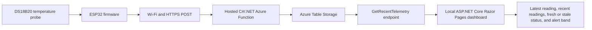
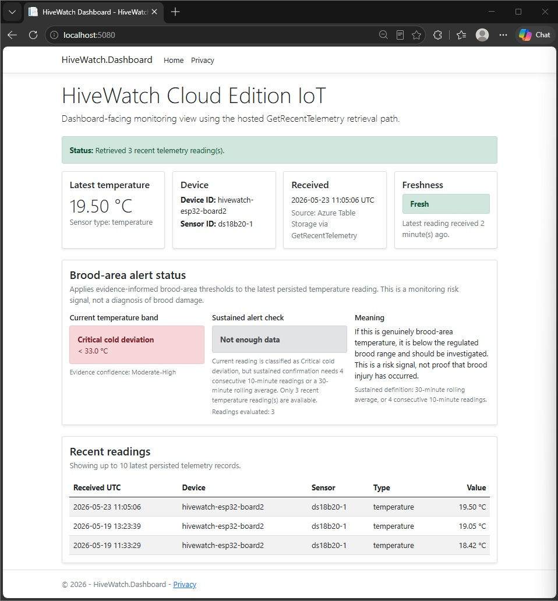

# HiveWatch Cloud Internet of Things (IoT)

HiveWatch Cloud IoT is built around a simple problem: a beekeeper cannot protect what they cannot see between inspections.

Inside every productive hive is a nursery called the brood nest. This is where eggs, larvae and developing young bees depend on stable warmth. When that temperature falls, rises or becomes unstable for long enough, the colony may face higher risk of stress, poor development, disease related problems or other issues that need attention.

HiveWatch gives beekeepers remote visibility across dispersed apiary sites. Using a physical temperature sensor, it captures hive readings, sends them to the cloud, stores the data, and presents recent readings, alert bands, and whether the latest hive reading is fresh or stale on a dashboard that can be checked from home or while on the go.

The system does not diagnose disease, queen failure, brood damage or colony loss. Instead, it gives beekeepers early warning signals so they can decide which hives deserve inspection first and combine remote telemetry with practical judgement at the hive.

The goal is simple: fewer blind spots, faster attention and better informed hive management decisions.

---

## At a glance

| Area | Current position |
|---|---|
| Project type | Solo CT-5222 capstone project |
| Main purpose | Remote beehive temperature monitoring for dispersed apiary sites |
| Core sensor | DS18B20 waterproof temperature probe |
| Device layer | ESP32 development board running Arduino/C++ firmware |
| Cloud backend | C#/.NET 8 isolated Azure Functions |
| Storage layer | Azure Table Storage using the `TelemetryReadings` table |
| Retrieval path | Hosted `GetRecentTelemetry` endpoint |
| Dashboard | Local ASP.NET Core Razor Pages dashboard |
| Current dashboard behaviour | Latest reading, recent readings, fresh or stale state, and temperature alert band |
| Current validation status | Full bench chain validated on 23 May 2026 |
| Key boundary | Bench validated prototype, not a production hive monitoring system or biological diagnosis tool |

---

## Current validated baseline

The current implementation validates a real physical temperature reading travelling through the complete baseline path:

| Step | Component | Role |
|---:|---|---|
| 1 | DS18B20 waterproof temperature probe | Captures the hive temperature reading |
| 2 | ESP32 firmware | Reads the sensor and prepares the telemetry payload |
| 3 | Wi-Fi and HTTPS POST | Sends the reading from the device to the cloud |
| 4 | Hosted C#/.NET Azure Function | Accepts and validates incoming telemetry |
| 5 | Azure Table Storage | Persists accepted readings in `TelemetryReadings` |
| 6 | Hosted `GetRecentTelemetry` endpoint | Retrieves recent stored telemetry |
| 7 | Local ASP.NET Core Razor Pages dashboard | Displays latest reading, recent readings, fresh or stale state, and alert band |

On 23 May 2026, a live DS18B20 bench reading of `19.50 °C` was captured by the ESP32 device, posted over Wi-Fi and HTTPS to the hosted Azure Function, accepted with HTTP `200`, persisted in Azure Table Storage, retrieved through `GetRecentTelemetry`, and displayed in the local Razor Pages dashboard as the latest reading with Fresh status and brood temperature alert classification.

This result validates the current system path under controlled bench conditions. It does not represent in-hive field validation, production alerting, or a completed sustained telemetry run.

---

## How it works

The validated baseline moves a real hive temperature reading through the following path:



### Architecture notes

| Layer | Role |
|---|---|
| Sensor | Captures a hive temperature reading using a DS18B20 waterproof probe |
| ESP32 firmware | Reads the probe, prepares a JSON telemetry payload, and sends it over Wi-Fi |
| `IngestTelemetry` | Validates incoming telemetry and stores accepted readings |
| Azure Table Storage | Provides durable storage for accepted telemetry records |
| `GetRecentTelemetry` | Reads back recent stored telemetry for dashboard use |
| Razor Pages dashboard | Displays latest reading, recent readings, fresh or stale state, and alert band |

---

## Dashboard behaviour

The local dashboard currently displays:

| Dashboard element | Purpose |
|---|---|
| Latest temperature reading | Shows the newest stored hive temperature reading returned by the cloud retrieval path |
| Recent readings table | Shows recent persisted telemetry records |
| Fresh or stale state | Shows whether the latest hive reading still reflects recent telemetry |
| Temperature alert band | Classifies the latest reading against evidence informed brood nest temperature bands |
| Sustained alert data sufficiency | Separates an immediate out of range reading from a sustained alert state requiring enough recent readings |

The dashboard is currently local and read only. Azure dashboard deployment remains a planned milestone.

---

## Temperature alert boundary

HiveWatch uses temperature bands as monitoring signals. They help identify when a hive may deserve closer inspection, but they do not prove brood damage, disease, queen failure or colony loss.

Current alert wording is intentionally cautious:

| Reading pattern | Meaning in HiveWatch |
|---|---|
| Temperature outside expected range | The hive may deserve inspection or closer attention |
| Latest reading is stale | The dashboard may no longer reflect current hive conditions |
| Not enough readings for sustained alert | The current value can be classified, but sustained confirmation is not yet available |

This boundary matters because a bench temperature reading can validate system behaviour without proving the biological condition of a real hive.

---

## Current status

| Area | Status |
|---|---|
| DS18B20 sensor detection | Validated |
| Live local temperature readings | Validated |
| ESP32 Wi-Fi connectivity | Validated |
| Remote telemetry POST smoke test | Validated |
| Azure Function ingestion endpoint | Validated |
| ESP32 to hosted Azure Function telemetry POST | Validated |
| Accepted telemetry to Azure Table Storage persistence | Validated |
| Latest and recent stored telemetry retrieval endpoint | Validated |
| Local dashboard latest reading view | Validated locally |
| Local dashboard recent readings table | Validated locally |
| Local dashboard fresh or stale state | Validated locally |
| Local dashboard brood temperature alert status | Validated locally |
| Fresh full chain bench validation | Validated on 23 May 2026 |
| Dashboard analytics | Future milestone |
| Azure dashboard deployment | Future milestone |
| CI/CD refinement | Future milestone |
| Sustained telemetry validation | Future milestone |

---

## Validation evidence

### Fresh full chain validation, 23 May 2026

The fresh validation evidence is stored in:

```text
docs/evidence/2026-05-23-fresh-full-chain-validation/
```

| Evidence artefact | What it demonstrates |
|---|---|
| [`serial-monitor-success.jpg`](docs/evidence/2026-05-23-fresh-full-chain-validation/serial-monitor-success.jpg) | ESP32 Wi-Fi connection, DS18B20 reading, JSON payload, hosted Azure Function POST, HTTP 200 response, and accepted telemetry |
| [`azure-table-storage-row.jpg`](docs/evidence/2026-05-23-fresh-full-chain-validation/azure-table-storage-row.jpg) | New `19.5 °C` telemetry row persisted in Azure Table Storage |
| [`dashboard-fresh-alert-status.jpg`](docs/evidence/2026-05-23-fresh-full-chain-validation/dashboard-fresh-alert-status.jpg) | Dashboard retrieved the fresh row, displayed Fresh status, showed recent readings, and classified the alert band |



### Earlier staged validation evidence

| Evidence | Screenshot |
|---|---|
| ESP32 and DS18B20 temperature probe bench setup | [`docs/images/esp32-ds18b20-bench-setup.jpg`](docs/images/esp32-ds18b20-bench-setup.jpg) |
| Hosted Azure Function telemetry POST success | [`docs/images/azure-function-post-success.jpg`](docs/images/azure-function-post-success.jpg) |
| Azure Table Storage persistence | [`docs/images/azure-table-persistence.jpg`](docs/images/azure-table-persistence.jpg) |
| Local dashboard recent readings and fresh or stale state | [`docs/images/dashboard-recent-readings-freshness.jpg`](docs/images/dashboard-recent-readings-freshness.jpg) |
| Local dashboard brood temperature alert status | [`docs/images/dashboard-brood-alert-status.jpg`](docs/images/dashboard-brood-alert-status.jpg) |

---

## Technology stack

| Area | Technologies used |
|---|---|
| Device and firmware | ESP32 development board, Arduino IDE, Arduino/C++ sketches |
| Sensor layer | DS18B20 waterproof temperature probe, OneWire library, DallasTemperature library |
| Connectivity and payload | Wi-Fi, HTTP/HTTPS POST, JSON telemetry payloads |
| Cloud backend | Azure Functions, Azure Table Storage, .NET 8 isolated worker model, C# |
| Storage integration | Azure.Data.Tables client library, `TelemetryReadings` table |
| Retrieval path | HTTP GET Function endpoint, latest and recent stored telemetry JSON read back |
| Dashboard | ASP.NET Core Razor Pages, typed `HttpClient`, Bootstrap based Razor Pages UI |
| Validation and integration testing | Arduino Serial Monitor, Webhook.site remote POST smoke test, PowerShell REST checks, Azure Table Storage inspection, local dashboard browser checks |
| Version control | Git, GitHub branches, pull requests and evidence commits |

---

## Firmware validation sequence

The firmware proofs are retained in the order used to reduce implementation risk.

| Stage | Purpose |
|---|---|
| `01_one_wire_scanner_test` | Detect the DS18B20 probe on the 1-Wire bus |
| `02_live_temperature_readings` | Produce live local temperature readings in the Serial Monitor |
| `03_wifi_connection_only_test` | Prove ESP32 Wi-Fi connectivity independently of the sensor |
| `04_remote_webhook_telemetry_smoke_test` | POST live temperature telemetry to a temporary Webhook.site endpoint |
| `05_local_azure_function_post_test` | Test the device-side POST shape against a laptop-local Azure Function route during integration work |
| `06_hosted_azure_function_post_test` | POST live temperature telemetry to the hosted Azure Function endpoint |

This staged approach keeps the project traceable and makes the progression from device validation to cloud ingestion explicit.

---

## Azure Function endpoints

The cloud component is a .NET 8 isolated Azure Function project containing two HTTP triggered endpoints.

```text
IngestTelemetry
GetRecentTelemetry
```

### `IngestTelemetry`

The ingestion endpoint currently:

| Behaviour | Status |
|---|---|
| Accepts HTTP POST requests | Implemented |
| Deserialises incoming telemetry JSON | Implemented |
| Validates required fields | Implemented |
| Persists accepted telemetry to Azure Table Storage | Implemented |
| Returns a structured accepted response only after persistence succeeds | Implemented |
| Returns a server-side error response if valid telemetry cannot be stored | Implemented |

Example telemetry payload shape:

```json
{
  "device_id": "hivewatch-esp32-device",
  "sensor_id": "ds18b20-1",
  "type": "temperature",
  "unit": "C",
  "value": 19.50
}
```

Example accepted response shape:

```json
{
  "status": "accepted",
  "received_at_utc": "2026-05-23T11:05:06.7133161+00:00",
  "telemetry": {
    "device_id": "hivewatch-esp32-device",
    "sensor_id": "ds18b20-1",
    "type": "temperature",
    "unit": "C",
    "value": 19.50
  }
}
```

### `GetRecentTelemetry`

The retrieval endpoint currently:

| Behaviour | Status |
|---|---|
| Accepts HTTP GET requests | Implemented |
| Reads stored telemetry from Azure Table Storage | Implemented |
| Orders readings by `ReceivedAtUtc` from newest to oldest | Implemented |
| Returns a default of 20 readings if no `limit` is supplied | Implemented |
| Accepts a positive whole number `limit` query parameter | Implemented |
| Enforces an internal maximum of 100 readings | Implemented |
| Rejects invalid `limit` values with HTTP 400 Bad Request | Implemented |

Example retrieval route:

```text
GET /api/GetRecentTelemetry?limit=10
```

Example retrieval response shape:

```json
{
  "status": "ok",
  "count": 3,
  "readings": [
    {
      "deviceId": "hivewatch-esp32-device",
      "sensorId": "ds18b20-1",
      "type": "temperature",
      "unit": "C",
      "value": 19.50,
      "receivedAtUtc": "2026-05-23T11:05:06.7133161+00:00"
    }
  ]
}
```

---

## Repository layout

```text
hivewatch-cloud-iot/
├── cloud/
│   ├── HiveWatch.TelemetryIngestor.slnx
│   └── HiveWatch.TelemetryIngestor/
├── dashboard/
│   ├── HiveWatch.Dashboard.slnx
│   └── HiveWatch.Dashboard/
├── docs/
│   ├── evidence/
│   │   └── 2026-05-23-fresh-full-chain-validation/
│   └── images/
├── firmware/
│   └── proofs/
├── .gitignore
└── README.md
```

---

## Configuration and security notes

This repository is prepared for public sharing and intentionally excludes local or secret bearing configuration.

Placeholder values are used for:

| Placeholder type | Reason |
|---|---|
| Wi-Fi network credentials | Prevents private network details being committed |
| Temporary Webhook.site URLs | Prevents obsolete external test URLs being treated as production endpoints |
| Hosted Azure Function endpoint URLs | Avoids exposing live endpoint details in public source files |

The Azure Function expects runtime configuration for:

| Setting | Purpose |
|---|---|
| `TelemetryStorageConnectionString` | Required Azure Storage connection string |
| `TelemetryTableName` | Optional table name override. The code defaults to `TelemetryReadings` |

These values are configured locally through ignored settings files or in hosted Azure Function App environment settings. They are not committed to the repository.

Some proof of concept firmware sketches use:

```cpp
secureClient.setInsecure();
```

This kept early HTTPS smoke tests simple. A hardened production version would use proper certificate validation.

---

## Next planned milestone

The next development step is to build on the validated baseline by adding:

| Priority | Next work |
|---|---|
| 1 | Basic analytics such as latest, minimum, maximum, average and simple trend |
| 2 | Azure dashboard deployment through the planned App Service route or documented fallback |
| 3 | CI/CD refinement for build and test confidence |
| 4 | Sustained bench telemetry validation |

The project now has a validated technical baseline. The next phase is controlled completion, not proving the chain works once.

---

## Project direction

HiveWatch Cloud IoT now has a working baseline across physical sensing, embedded firmware, cloud ingestion, cloud persistence, hosted retrieval and local dashboard display. The project will now mature toward analytics, Azure dashboard deployment, CI/CD refinement and sustained telemetry validation.

Heavier items such as Azure IoT Hub, Cosmos DB, Terraform, external notifications and extra sensors remain stretch goals only until the core monitoring system is submission safe.
