# HiveWatch Cloud Internet of Things (IoT)

[](https://github.com/sdaly-ie/hivewatch-cloud-iot/actions/workflows/dotnet-build.yml)
[](https://github.com/sdaly-ie/hivewatch-cloud-iot/releases/tag/v1.0.0)


**A sensor-to-cloud beehive temperature-monitoring prototype using ESP32, Azure Functions, Azure Table Storage and an ASP.NET Core dashboard.**

HiveWatch Cloud IoT is built around a simple problem: a beekeeper cannot protect what they cannot see between inspections. Inside every productive hive is a nursery called the brood nest. This is where eggs, larvae and developing young bees depend on stable warmth. When that temperature falls, rises or becomes unstable for long enough, the colony may face higher risk of stress, poor development, disease-related problems or other issues that need attention.

HiveWatch gives beekeepers remote visibility across dispersed apiary sites. Using a physical temperature sensor, it captures hive readings, sends them to the cloud, stores the data, and presents recent readings, alert bands, freshness status and baseline analytics on a dashboard that can be checked from home or while on the go.

The system does not diagnose disease, queen failure, brood damage or colony loss. Instead, it gives beekeepers early warning signals so they can decide which hives deserve inspection first and combine remote telemetry with practical judgement at the hive. The goal is simple: fewer blind spots, faster attention and better informed hive management decisions.

---

## Contents

- [Release status](#release-status)
- [At a glance](#at-a-glance)
- [Current validated baseline](#current-validated-baseline)
- [How it works](#how-it-works)
- [Dashboard behaviour](#dashboard-behaviour)
- [Temperature alert boundary](#temperature-alert-boundary)
- [Validated delivery status](#validated-delivery-status)
- [Validation evidence](#validation-evidence)
- [Technology stack](#technology-stack)
- [Firmware validation sequence](#firmware-validation-sequence)
- [Azure Function endpoints](#azure-function-endpoints)
- [Container and Azure dashboard deployment](#container-and-azure-dashboard-deployment)
- [Repository layout](#repository-layout)
- [Configuration and security notes](#configuration-and-security-notes)
- [Known limitations](#known-limitations)
- [Post-capstone direction](#post-capstone-direction)

---

## Release status

HiveWatch Cloud IoT has reached the `v1.0.0` capstone prototype baseline.

The physical sensor-to-cloud telemetry path, Azure-hosted dashboard, Docker deployment, targeted automated tests, bounded failure-mode checks, full 24-hour sustained bench validation, dashboard auto-refresh, dependency-security automation and CodeQL remediation have been completed and evidenced at prototype level.

The repository is now under technical freeze following the `v1.0.0` release. Further feature development, infrastructure expansion and routine dependency modernisation are deferred to a future post-capstone phase.

- [View the v1.0.0 release](https://github.com/sdaly-ie/hivewatch-cloud-iot/releases/tag/v1.0.0)

> **For reviewers:** `v1.0.0` is the stable capstone submission snapshot. Please use the release page when reviewing the submitted project. The `main` branch may receive maintenance updates after submission.

This release remains a controlled bench prototype. It does not claim production readiness, live in-hive validation, service-level availability, exhaustive security assurance or biological diagnosis.

---

## At a glance

| Area | Final position |
|---|---|
| Project type | Solo CT-5222 capstone project |
| Release | `v1.0.0` capstone prototype baseline |
| Release state | Technically complete and under technical freeze following the `v1.0.0` release |
| Main purpose | Remote beehive temperature monitoring for dispersed apiary sites |
| Core sensor | DS18B20 waterproof temperature probe |
| Device layer | ESP32 development board running Arduino/C++ firmware |
| Cloud backend | C#/.NET 8 isolated Azure Functions |
| Storage layer | Azure Table Storage using the `TelemetryReadings` table |
| Retrieval path | Hosted `GetRecentTelemetry` endpoint |
| Dashboard | ASP.NET Core Razor Pages dashboard with bounded automatic refresh every 5 minutes 30 seconds, validated locally, in Docker and as an Azure-hosted prototype |
| Deployment route | Docker image pushed to Azure Container Registry and hosted through Azure App Service for Containers |
| Validation | Full bench chain, baseline analytics, Azure deployment, post-deployment regression, bounded failure-mode checks, CI and targeted tests, short sustained dry run, full 24-hour sustained telemetry validation and dashboard auto-refresh validation completed |
| Security assurance | Dependency graph, Dependabot alerts and security updates enabled; CodeQL enabled for C#, JavaScript/TypeScript and GitHub Actions within the documented prototype scope |
| Cost-control position | Dashboard App Service Plan retained on F1 Free after validation. Basic Azure Container Registry is retained temporarily to preserve the deployment path for demonstration and review. |
| Key boundary | Bench-validated and Azure-hosted prototype, not a production hive-monitoring system or biological diagnosis tool |

---

## Current validated baseline

The `v1.0.0` release validates a real physical temperature reading travelling through the complete baseline path:

| Step | Component | Role |
|---:|---|---|
| 1 | DS18B20 waterproof temperature probe | Captures the hive temperature reading |
| 2 | ESP32 firmware | Reads the sensor and prepares the telemetry payload |
| 3 | Wi-Fi and HTTPS POST | Sends the reading from the device to the cloud |
| 4 | Hosted C#/.NET Azure Function | Accepts and validates incoming telemetry |
| 5 | Azure Table Storage | Persists accepted readings in `TelemetryReadings` |
| 6 | Hosted `GetRecentTelemetry` endpoint | Retrieves recent stored telemetry |
| 7 | ASP.NET Core Razor Pages dashboard | Displays latest reading, recent readings, fresh or stale state, alert band and baseline analytics, with bounded automatic refresh every 5 minutes 30 seconds |
| 8 | Docker container image | Packages the dashboard for repeatable container deployment |
| 9 | Azure Container Registry | Stores the dashboard image used by Azure App Service |
| 10 | Azure App Service for Containers | Hosts the dashboard as an Azure web application |
| 11 | GitHub Actions | Builds the Azure Function and dashboard and runs targeted dashboard logic tests |

A live DS18B20 bench reading of `19.50 °C` was captured by the ESP32, posted over Wi-Fi and HTTPS to the hosted Azure Function, accepted with HTTP `200`, persisted in Azure Table Storage, retrieved through `GetRecentTelemetry`, and displayed in the dashboard with Fresh status and brood-temperature alert classification.

The delivered prototype was subsequently strengthened through:

- Baseline analytics covering latest, minimum, maximum, average, median, reading count and simple trend.
- Docker containerisation and Azure App Service for Containers deployment.
- Structured post-deployment regression, minimal build-and-test CI and eight targeted xUnit tests.
- Bounded failure-mode checks confirming HTTP `400` responses for invalid JSON and missing required telemetry fields.
- A short repeated-post dry run, followed by a full 24-hour sustained bench validation containing 285 persisted readings against an ideal 289-reading schedule, representing 98.62% delivery.
- Bounded dashboard auto-refresh every 5 minutes 30 seconds, validated locally, in Docker and through two hosted Azure reload cycles returning HTTP `200`.
- Dependabot security automation and CodeQL scanning, including remediation and closure of the two initial CodeQL findings.

<sub><strong>Scope note:</strong> These results support prototype-level confidence and demonstration readiness. They do not establish production hardening, guaranteed service availability, live in-hive performance or biological diagnosis.</sub>

---

## How it works

The validated baseline moves a real hive temperature reading through the following path:

```mermaid
flowchart LR
    A["DS18B20 temperature probe"] --> B["ESP32 firmware"]
    B --> C["Wi-Fi and HTTPS POST"]
    C --> D["Hosted C#/.NET Azure Function"]
    D --> E["Azure Table Storage"]
    E --> F["GetRecentTelemetry endpoint"]
    F --> G["ASP.NET Core Razor Pages dashboard"]
    G --> H["Docker container image"]
    H --> I["Azure Container Registry"]
    I --> J["Azure App Service for Containers"]
    J --> K["Hosted dashboard: latest reading, recent readings, freshness, alert band, baseline analytics and bounded automatic refresh"]
```



### Architecture notes

| Layer | Role |
|---|---|
| Sensor | Captures a hive temperature reading using a DS18B20 waterproof probe |
| ESP32 firmware | Reads the probe, prepares a JSON telemetry payload, and sends it over Wi-Fi |
| `IngestTelemetry` | Validates incoming telemetry and stores accepted readings |
| Azure Table Storage | Provides durable storage for accepted telemetry records |
| `GetRecentTelemetry` | Reads back recent stored telemetry for dashboard use |
| Razor Pages dashboard | Displays latest reading, recent readings, fresh or stale state, alert band and baseline analytics, and reloads the page every 5 minutes 30 seconds |
| Docker container image | Packages the dashboard with a multi-stage .NET 8 build for container deployment |
| Azure Container Registry | Stores the versioned dashboard image for App Service pull |
| Azure App Service for Containers | Hosts the dashboard as a deployed Azure web application |
| GitHub Actions | Provides build-and-test validation for pull requests and pushes to `main` |

---

## Dashboard behaviour

The dashboard displays:

| Dashboard element | Purpose |
|---|---|
| Latest temperature reading | Shows the newest stored hive temperature reading returned by the cloud retrieval path |
| Recent readings table | Shows recent persisted telemetry records |
| Fresh or stale state | Shows whether the latest hive reading still reflects recent telemetry |
| Temperature alert band | Classifies the latest reading against evidence-informed brood nest temperature bands |
| Sustained alert data sufficiency | Separates an immediate out-of-range reading from a sustained alert state requiring enough recent readings |
| Baseline analytics | Summarises retrieved temperature readings using latest, minimum, maximum, average, median, reading count and simple trend status |
| Automatic page refresh | Reloads the dashboard every 5 minutes 30 seconds so newly persisted telemetry can be retrieved without manual page refresh |

The dashboard is read-only and has been validated in three forms:

| Dashboard form | Current status |
|---|---|
| Local Razor Pages dashboard | Validated |
| Local Docker container | Validated |
| Azure App Service for Containers | Validated through prototype smoke testing, post-deployment regression and two hosted automatic-refresh cycles |

---

## Temperature alert boundary

HiveWatch uses temperature bands as monitoring signals. They help identify when a hive may deserve closer inspection, but they do not prove brood damage, disease, queen failure or colony loss.

Current alert wording is intentionally cautious:

| Reading pattern | Meaning in HiveWatch |
|---|---|
| Temperature outside expected range | The hive may deserve inspection or closer attention |
| Latest reading is stale | The dashboard may no longer reflect current hive conditions |
| Not enough readings for sustained alert | The current value can be classified, but sustained confirmation is not yet available |
| Sustained alert confirmed | Recent readings support an alert state, but this remains a telemetry signal requiring beekeeper judgement |

This boundary matters because a bench temperature reading can validate system behaviour without proving the biological condition of a real hive.

---

## Validated delivery status

| Area | Status |
|---|---|
| DS18B20 sensor detection and live readings | Validated |
| ESP32 Wi-Fi connectivity and remote telemetry POST | Validated |
| Azure Function ingestion | Validated |
| Azure Table Storage persistence | Validated |
| `GetRecentTelemetry` retrieval | Validated |
| Local dashboard latest/recent readings, freshness and alert status | Validated |
| Dashboard baseline analytics | Validated |
| Expansion-board DS18B20 hardware-layout revalidation | Validated |
| Local dashboard containerisation | Validated |
| Azure dashboard deployment | Validated at prototype level and cost-controlled on F1 Free |
| Post-deployment regression | Validated |
| Build-and-test CI | GitHub Actions workflow implemented and validated |
| Targeted automated tests | Eight deterministic dashboard alert and analytics tests implemented and passing |
| Bounded failure-mode checks | Invalid JSON and missing required fields rejected with HTTP `400` |
| Sustained hosted telemetry dry run | Four accepted interval posts, zero failed/skipped posts and Azure Table Storage persistence |
| Full 24-hour sustained telemetry validation | 285 readings in the formal window; 98.62% against the ideal schedule; two bounded gaps; autonomous recovery observed |
| Dashboard automatic refresh | Validated locally, in Docker and through two Azure-hosted reload cycles scheduled 5 minutes 30 seconds apart |
| Dependabot security automation | Dependency graph, alerts and security updates enabled; routine version-update PRs paused for release closure |
| CodeQL scanning | Enabled and healthy for C#, JavaScript/TypeScript and GitHub Actions |
| CodeQL findings | 0 open and 2 closed at the recorded release-closure point |
| Repository release | `v1.0.0` capstone prototype baseline |
| Technical freeze | Applied with the `v1.0.0` release |

---

## Validation evidence

### Post-deployment regression validation

The post-deployment regression evidence is stored in [`docs/evidence/2026-07-05-post-deployment-regression/`](docs/evidence/2026-07-05-post-deployment-regression/).

| Evidence artefact | What it demonstrates |
|---|---|
| [`serial-monitor-ingestion-regression-2026-07-05.jpg`](docs/evidence/2026-07-05-post-deployment-regression/serial-monitor-ingestion-regression-2026-07-05.jpg) | ESP32 board, DS18B20 reading, JSON payload, hosted POST and HTTP `200` response |
| [`azure-table-storage-persistence-regression-2026-07-05.jpg`](docs/evidence/2026-07-05-post-deployment-regression/azure-table-storage-persistence-regression-2026-07-05.jpg) | New telemetry row persisted in Azure Table Storage |
| [`get-recent-telemetry-retrieval-regression-2026-07-05.jpg`](docs/evidence/2026-07-05-post-deployment-regression/get-recent-telemetry-retrieval-regression-2026-07-05.jpg) | Hosted retrieval endpoint returning recent telemetry |
| [`invalid-limit-retrieval-regression-2026-07-05.jpg`](docs/evidence/2026-07-05-post-deployment-regression/invalid-limit-retrieval-regression-2026-07-05.jpg) | Invalid retrieval `limit` handled with HTTP `400` |
| [`dashboard-local-ui-regression-2026-07-05.jpg`](docs/evidence/2026-07-05-post-deployment-regression/dashboard-local-ui-regression-2026-07-05.jpg) | Local dashboard rendering latest reading, freshness, alert and analytics panels |
| [`docker-image-build-regression-2026-07-05.jpg`](docs/evidence/2026-07-05-post-deployment-regression/docker-image-build-regression-2026-07-05.jpg) | Dashboard Docker image built successfully |
| [`docker-container-runtime-regression-2026-07-05.jpg`](docs/evidence/2026-07-05-post-deployment-regression/docker-container-runtime-regression-2026-07-05.jpg) | Dashboard container running locally and returning HTTP `200` |
| [`dashboard-docker-ui-regression-2026-07-05.jpg`](docs/evidence/2026-07-05-post-deployment-regression/dashboard-docker-ui-regression-2026-07-05.jpg) | Docker-hosted dashboard rendering correctly |
| [`azure-hosted-dashboard-ui-regression-2026-07-05.jpg`](docs/evidence/2026-07-05-post-deployment-regression/azure-hosted-dashboard-ui-regression-2026-07-05.jpg) | Azure-hosted dashboard rendering correctly after deployment |
| [`post-deployment-regression-evidence-note.txt`](docs/evidence/2026-07-05-post-deployment-regression/post-deployment-regression-evidence-note.txt) | Text note summarising regression scope, evidence and prototype boundary |

### Bounded failure-mode validation

The bounded failure-mode evidence is stored in [`docs/evidence/2026-07-07-bounded-failure-mode-evidence/`](docs/evidence/2026-07-07-bounded-failure-mode-evidence/).

| Evidence artefact | What it demonstrates |
|---|---|
| [`bounded-failure-mode-terminal-output-2026-07-07.txt`](docs/evidence/2026-07-07-bounded-failure-mode-evidence/bounded-failure-mode-terminal-output-2026-07-07.txt) | Hosted `IngestTelemetry` rejected invalid JSON and missing required telemetry fields with HTTP `400` responses |
| [`bounded-failure-mode-evidence-note.txt`](docs/evidence/2026-07-07-bounded-failure-mode-evidence/bounded-failure-mode-evidence-note.txt) | Summarises scope, purpose, endpoint handling and prototype boundary for the bounded failure-mode evidence |

### Sustained hosted telemetry dry-run validation

The sustained hosted telemetry dry-run evidence is stored in [`docs/evidence/2026-07-11-sustained-hosted-telemetry-run/`](docs/evidence/2026-07-11-sustained-hosted-telemetry-run/).

| Evidence artefact | What it demonstrates |
|---|---|
| [`sustained-hosted-telemetry-dry-run-multiple-posts-accepted-2026-07-11.jpg`](docs/evidence/2026-07-11-sustained-hosted-telemetry-run/sustained-hosted-telemetry-dry-run-multiple-posts-accepted-2026-07-11.jpg) | ESP32 board, DS18B20 detection, Wi-Fi connection, repeated five-minute telemetry attempts, HTTP `200` responses, `Successful POST count: 4` and `Failed/skipped POST count: 0` |
| [`azure-table-storage-sustained-telemetry-persistence-2026-07-11.jpg`](docs/evidence/2026-07-11-sustained-hosted-telemetry-run/azure-table-storage-sustained-telemetry-persistence-2026-07-11.jpg) | Persisted `TelemetryReadings` rows for the ESP32 board and DS18B20 sensor after the sustained dry run |
| [`sustained-hosted-telemetry-run-evidence-note.txt`](docs/evidence/2026-07-11-sustained-hosted-telemetry-run/sustained-hosted-telemetry-run-evidence-note.txt) | Summarises sustained dry-run scope, observed outcome, evidence files and prototype boundary |

### Full 24-hour sustained bench telemetry validation

The full sustained-run evidence is stored in [`docs/evidence/2026-07-11-24-hour-sustained-telemetry-run/`](docs/evidence/2026-07-11-24-hour-sustained-telemetry-run/).

The formal validation window ran from `2026-07-11 16:20:48 UTC` to `2026-07-12 16:20:48 UTC`. It contained 285 persisted readings against an ideal 289-reading five-minute schedule. Two bounded gaps were identified, after which telemetry resumed without manual intervention. The independently powered prototype continued operating beyond the formal stop time.

| Evidence artefact | What it demonstrates |
|---|---|
| [`24-hour-sustained-telemetry-run-evidence-note.txt`](docs/evidence/2026-07-11-24-hour-sustained-telemetry-run/24-hour-sustained-telemetry-run-evidence-note.txt) | Validation window, expected-versus-received analysis, temperature statistics, gap analysis, conclusion and prototype boundary |
| [`24-hour-sustained-telemetry-formal-window-2026-07-12.csv`](docs/evidence/2026-07-11-24-hour-sustained-telemetry-run/24-hour-sustained-telemetry-formal-window-2026-07-12.csv) | The 285 telemetry records falling inside the exact formal 24-hour window |
| [`24-hour-sustained-telemetry-export-2026-07-12.csv`](docs/evidence/2026-07-11-24-hour-sustained-telemetry-run/24-hour-sustained-telemetry-export-2026-07-12.csv) | Full run export showing continued telemetry beyond the required duration |
| [`24-hour-sustained-telemetry-raw-export-2026-07-12.json`](docs/evidence/2026-07-11-24-hour-sustained-telemetry-run/24-hour-sustained-telemetry-raw-export-2026-07-12.json) | Raw Azure Table Storage query result retained for traceability |
| [`azure-table-storage-24-hour-sustained-telemetry-final-state-2026-07-12.jpg`](docs/evidence/2026-07-11-24-hour-sustained-telemetry-run/azure-table-storage-24-hour-sustained-telemetry-final-state-2026-07-12.jpg) | Continued persistence of telemetry in Azure Table Storage after the formal validation window |
| [`azure-hosted-dashboard-24-hour-sustained-telemetry-final-state-2026-07-12.jpg`](docs/evidence/2026-07-11-24-hour-sustained-telemetry-run/azure-hosted-dashboard-24-hour-sustained-telemetry-final-state-2026-07-12.jpg) | Hosted dashboard retrieving current telemetry and displaying Fresh status, analytics, alert status and recent readings |
| [`physical-bench-setup-24-hour-sustained-telemetry-run-2026-07-11.jpg`](docs/evidence/2026-07-11-24-hour-sustained-telemetry-run/physical-bench-setup-24-hour-sustained-telemetry-run-2026-07-11.jpg) | Independently powered ESP32, DS18B20 probe and prototype bench arrangement used during the sustained validation |

### Dashboard auto-refresh validation

The dashboard auto-refresh evidence is stored in [`docs/evidence/2026-07-12-dashboard-auto-refresh-validation/`](docs/evidence/2026-07-12-dashboard-auto-refresh-validation/).

The dashboard Index page uses a browser timeout of `330000` milliseconds to perform a full-page reload every 5 minutes 30 seconds. The implementation was validated locally, through the existing automated tests and GitHub Actions workflow, in a local Docker container and through the Azure-hosted deployment. Two hosted automatic-refresh cycles returned HTTP `200`, while telemetry, freshness, analytics, alert status and recent readings continued to render correctly.

| Evidence artefact | What it demonstrates |
|---|---|
| [`azure-hosted-dashboard-auto-refresh-after-two-cycles-2026-07-12.jpg`](docs/evidence/2026-07-12-dashboard-auto-refresh-validation/azure-hosted-dashboard-auto-refresh-after-two-cycles-2026-07-12.jpg) | Hosted dashboard rendering current telemetry and the configured refresh notice after two automatic cycles |
| [`azure-hosted-dashboard-auto-refresh-network-validation-2026-07-12.jpg`](docs/evidence/2026-07-12-dashboard-auto-refresh-validation/azure-hosted-dashboard-auto-refresh-network-validation-2026-07-12.jpg) | DevTools Network evidence showing the initial request and two subsequent document reloads returning HTTP `200` |
| [`azure-hosted-dashboard-auto-refresh-console-validation-2026-07-12.jpg`](docs/evidence/2026-07-12-dashboard-auto-refresh-validation/azure-hosted-dashboard-auto-refresh-console-validation-2026-07-12.jpg) | Browser navigation type reported as `reload` and the configured interval reported as `330000` milliseconds |
| [`dashboard-auto-refresh-validation-evidence-note.txt`](docs/evidence/2026-07-12-dashboard-auto-refresh-validation/dashboard-auto-refresh-validation-evidence-note.txt) | Validation scope, implementation boundary, build and test results, Docker checks, Azure deployment details and hosted two-cycle result |

The feature improves monitoring usability through periodic page reloads. It does not provide real-time push delivery, guaranteed refresh timing, service-level availability or production monitoring.

### Repository security automation and CodeQL closure

GitHub CodeQL default setup is enabled for C#, JavaScript/TypeScript and GitHub Actions. Two initial medium-severity findings in unused jQuery Validation template assets were investigated, remediated by removing the unused assets and closed after successful post-remediation analysis.

| Evidence artefact | What it demonstrates |
|---|---|
| [CodeQL default setup working as expected](docs/evidence/2026-07-14-codeql-implementation/github-codeql-default-setup-working-as-expected-2026-07-14.jpg) | Healthy configured analysis for C#, JavaScript/TypeScript and GitHub Actions |
| [CodeQL alerts resolved](docs/evidence/2026-07-14-codeql-implementation/github-codeql-alerts-resolved-0-open-2-closed-2026-07-14.jpg) | Recorded closure position of 0 open and 2 closed code-scanning alerts |

This evidence records the configured analysis scope and closure of identified findings. It does not claim exhaustive security assurance or production hardening.

### CI and automated test validation

The repository now includes a GitHub Actions workflow at [`.github/workflows/dotnet-build.yml`](.github/workflows/dotnet-build.yml).

The workflow currently:

| Workflow step | Purpose |
|---|---|
| Setup .NET 8 | Prepares the GitHub-hosted runner |
| Build Azure Function | Builds the telemetry ingestor project in Release configuration |
| Build dashboard | Builds the Razor Pages dashboard in Release configuration |
| Test dashboard logic | Runs targeted xUnit tests for dashboard service-layer logic |

The dashboard test suite is stored in [`dashboard/HiveWatch.Dashboard.Tests/`](dashboard/HiveWatch.Dashboard.Tests/).

Current targeted tests cover:

| Test area | Behaviour covered |
|---|---|
| No telemetry | Safe empty-state behaviour |
| Brood temperature alert classification | Cold deviation and reference-range classification |
| Sustained-alert behaviour | Not enough data versus confirmed sustained alert |
| Telemetry analytics | Count, latest, minimum, maximum, average and median |
| Trend classification | Rising, stable and falling trend states |

### Azure dashboard deployment validation

The Azure dashboard deployment evidence is stored in:

```text
docs/evidence/2026-06-02-azure-dashboard-deployment/
```

| Evidence artefact | What it demonstrates |
|---|---|
| [`2026-06-02-hivewatch-dashboard-azure-app-service-validation.jpg`](docs/evidence/2026-06-02-azure-dashboard-deployment/2026-06-02-hivewatch-dashboard-azure-app-service-validation.jpg) | Hosted Azure dashboard rendered over HTTPS with latest temperature, freshness, baseline analytics, brood-area alert status and recent readings |
| [`2026-06-02-azure-hosted-dashboard-terminal-validation-redacted.jpg`](docs/evidence/2026-06-02-azure-dashboard-deployment/2026-06-02-azure-hosted-dashboard-terminal-validation-redacted.jpg) | Redacted terminal evidence showing Azure Web App status, container configuration, app setting names and HTTP `200 OK` response |
| [`azure-dashboard-deployment-evidence-note.txt`](docs/evidence/2026-06-02-azure-dashboard-deployment/azure-dashboard-deployment-evidence-note.txt) | Text evidence note summarising hosted deployment, HTTP `200 OK`, Kestrel response, App Service container state, ACR managed identity pull and dashboard panel rendering |


### Expansion-board DS18B20 revalidation

On 29 May 2026, the established DS18B20 sensor-to-cloud-to-dashboard path was revalidated after mounting the ESP32 on the expansion board.

The revalidation confirmed that the ESP32 could still detect the DS18B20, capture a `21.25 °C` reading, submit it to the hosted Azure Function, receive an HTTP `200` accepted response, persist the reading in Azure Table Storage and retrieve it through the dashboard.

This was a hardware-layout regression check rather than a new feature or live in-hive validation.

The evidence is stored in:

`docs/evidence/2026-05-29-expansion-board-ds18b20-revalidation/`

| Evidence artefact | What it demonstrates |
|---|---|
| [Expansion-board bench setup](docs/evidence/2026-05-29-expansion-board-ds18b20-revalidation/esp32-expansion-board-ds18b20-bench-setup-2026-05-29.jpg) | ESP32 mounted on the expansion board with the DS18B20 probe and supporting prototype wiring used during the revalidation |
| [DS18B20 and hosted ingestion result](docs/evidence/2026-05-29-expansion-board-ds18b20-revalidation/ds18b20-expansion-retest-2026-05-29.jpg) | One DS18B20 detected, `21.25 °C` captured, Wi-Fi connected and the hosted Azure Function returned HTTP `200` with an accepted response |
| [Azure Table Storage persistence](docs/evidence/2026-05-29-expansion-board-ds18b20-revalidation/table-storage-ds18b20-retest-2026-05-29.jpg) | Corresponding telemetry records persisted in the `TelemetryReadings` table |
| [Dashboard retrieval and rendering](docs/evidence/2026-05-29-expansion-board-ds18b20-revalidation/dashboard-ds18b20-retest-2026-05-29.jpg) | Persisted readings retrieved and displayed with freshness, analytics and alert-status information |
### Baseline analytics validation

The baseline analytics evidence is stored in:

```text
docs/evidence/2026-05-25-baseline-analytics/
```

| Evidence artefact | What it demonstrates |
|---|---|
| [`dashboard-baseline-analytics.jpg`](docs/evidence/2026-05-25-baseline-analytics/dashboard-baseline-analytics.jpg) | Local dashboard baseline analytics panel showing latest, minimum, maximum, average, median, trend, recent readings and alert context |

### Fresh full chain validation

The fresh validation evidence is stored in:

```text
docs/evidence/2026-05-23-fresh-full-chain-validation/
```

| Evidence artefact | What it demonstrates |
|---|---|
| [`serial-monitor-success.jpg`](docs/evidence/2026-05-23-fresh-full-chain-validation/serial-monitor-success.jpg) | ESP32 Wi-Fi connection, DS18B20 reading, JSON payload, hosted Azure Function POST, HTTP `200` response and accepted telemetry |
| [`azure-table-storage-row.jpg`](docs/evidence/2026-05-23-fresh-full-chain-validation/azure-table-storage-row.jpg) | New `19.5 °C` telemetry row persisted in Azure Table Storage |
| [`dashboard-fresh-alert-status.jpg`](docs/evidence/2026-05-23-fresh-full-chain-validation/dashboard-fresh-alert-status.jpg) | Dashboard retrieved the fresh row, displayed Fresh status, showed recent readings and classified the alert band |

### Earlier staged validation evidence

| Evidence | Screenshot |
|---|---|
| ESP32 and DS18B20 temperature probe bench setup | [`docs/images/esp32-ds18b20-bench-setup.jpg`](docs/images/esp32-ds18b20-bench-setup.jpg) |
| Hosted Azure Function telemetry POST success | [`docs/images/azure-function-post-success.jpg`](docs/images/azure-function-post-success.jpg) |
| Azure Table Storage persistence | [`docs/images/azure-table-persistence.jpg`](docs/images/azure-table-persistence.jpg) |
| Local dashboard recent readings and fresh or stale state | [`docs/images/dashboard-recent-readings-freshness.jpg`](docs/images/dashboard-recent-readings-freshness.jpg) |
| Local dashboard brood temperature alert status | [`docs/images/dashboard-brood-alert-status.jpg`](docs/images/dashboard-brood-alert-status.jpg) |

---

## Technology stack

| Area | Technologies used |
|---|---|
| Device and firmware | ESP32 development board, Arduino IDE, Arduino/C++ sketches |
| Sensor layer | DS18B20 waterproof temperature probe, OneWire library, DallasTemperature library |
| Connectivity and payload | Wi-Fi, HTTP/HTTPS POST, JSON telemetry payloads |
| Cloud backend | Azure Functions, Azure Table Storage, .NET 8 isolated worker model, C# |
| Storage integration | Azure.Data.Tables client library, `TelemetryReadings` table |
| Retrieval path | HTTP GET Function endpoint, latest and recent stored telemetry JSON read back |
| Dashboard | ASP.NET Core Razor Pages, typed `HttpClient`, Bootstrap-based Razor Pages UI and bounded JavaScript page-reload timer |
| Dashboard logic tests | xUnit, Microsoft.NET.Test.Sdk, deterministic service-layer tests |
| CI validation | GitHub Actions build-and-test workflow |
| Repository security automation | GitHub dependency graph, Dependabot alerts and security updates, and CodeQL default setup |
| Containerisation | Docker Desktop, multi-stage .NET 8 Dockerfile, root `.dockerignore`, local dashboard image build |
| Azure dashboard hosting | Azure Container Registry, Azure App Service for Containers, Linux Web App, App Service Plan, managed identity, AcrPull, Azure CLI |
| Validation and integration testing | Arduino Serial Monitor, Webhook.site remote POST smoke test, PowerShell REST checks, Azure Table Storage inspection, local browser checks, Docker runtime checks, hosted Azure HTTP smoke checks |
| Version control | Git, GitHub branches, pull requests and evidence commits |

---

## Firmware validation sequence

The firmware proofs are retained in the order used to reduce implementation risk.

| Stage | Purpose |
|---|---|
| [`01_one_wire_scanner_test`](firmware/proofs/01_one_wire_scanner_test) | Detect the DS18B20 probe on the 1-Wire bus |
| [`02_live_temperature_readings`](firmware/proofs/02_live_temperature_readings) | Produce live local temperature readings in the Serial Monitor |
| [`03_wifi_connection_only_test`](firmware/proofs/03_wifi_connection_only_test) | Prove ESP32 Wi-Fi connectivity independently of the sensor |
| [`04_remote_webhook_telemetry_smoke_test`](firmware/proofs/04_remote_webhook_telemetry_smoke_test) | POST live temperature telemetry to a temporary Webhook.site endpoint |
| [`05_local_azure_function_post_test`](firmware/proofs/05_local_azure_function_post_test) | Test the device-side POST shape against a laptop-local Azure Function route during integration work |
| [`06_hosted_azure_function_post_test`](firmware/proofs/06_hosted_azure_function_post_test) | POST live temperature telemetry to the hosted Azure Function endpoint |
| [`07_sustained_hosted_telemetry_run`](firmware/proofs/07_sustained_hosted_telemetry_run) | Send an immediate hosted telemetry reading and continue posting at a five-minute interval for sustained bench validation |

This staged approach keeps the project traceable and makes the progression from device validation to cloud ingestion explicit.

---

## Azure Function endpoints

The cloud component is a .NET 8 isolated Azure Function project containing two HTTP-triggered endpoints.

```text
IngestTelemetry
GetRecentTelemetry
```

### `IngestTelemetry`

The ingestion endpoint currently:

| Behaviour | Status |
|---|---|
| Accepts HTTP POST requests | Implemented |
| Deserialises incoming telemetry JSON | Implemented |
| Validates required fields | Implemented |
| Persists accepted telemetry to Azure Table Storage | Implemented |
| Returns a structured accepted response only after persistence succeeds | Implemented |
| Returns a server-side error response if valid telemetry cannot be stored | Implemented |

Example telemetry payload shape:

```json
{
  "device_id": "hivewatch-esp32-device",
  "sensor_id": "ds18b20-1",
  "type": "temperature",
  "unit": "C",
  "value": 19.50
}
```

Example accepted response shape:

```json
{
  "status": "accepted",
  "received_at_utc": "ISO-8601 UTC timestamp",
  "telemetry": {
    "device_id": "hivewatch-esp32-device",
    "sensor_id": "ds18b20-1",
    "type": "temperature",
    "unit": "C",
    "value": 19.50
  }
}
```

### `GetRecentTelemetry`

The retrieval endpoint currently:

| Behaviour | Status |
|---|---|
| Accepts HTTP GET requests | Implemented |
| Reads stored telemetry from Azure Table Storage | Implemented |
| Orders readings by `ReceivedAtUtc` from newest to oldest | Implemented |
| Returns a default of 20 readings if no `limit` is supplied | Implemented |
| Accepts a positive whole number `limit` query parameter | Implemented |
| Enforces an internal maximum of 100 readings | Implemented |
| Rejects invalid `limit` values with HTTP `400 Bad Request` | Implemented |

Example retrieval route:

```text
GET /api/GetRecentTelemetry?limit=10
```

Example retrieval response shape:

```json
{
  "status": "ok",
  "count": 3,
  "readings": [
    {
      "deviceId": "hivewatch-esp32-device",
      "sensorId": "ds18b20-1",
      "type": "temperature",
      "unit": "C",
      "value": 19.50,
      "receivedAtUtc": "ISO-8601 UTC timestamp"
    }
  ]
}
```

---

## Container and Azure dashboard deployment

The dashboard includes a Dockerfile at:

```text
dashboard/HiveWatch.Dashboard/Dockerfile
```

The Dockerfile uses a multi-stage .NET 8 build. The SDK image restores and publishes the dashboard, and the ASP.NET runtime image runs `HiveWatch.Dashboard.dll` on port `8080`.

Example local image build:

```powershell
docker build -f dashboard/HiveWatch.Dashboard/Dockerfile -t hivewatch-dashboard:local .
```

Example local container run shape, with the telemetry endpoint supplied at runtime rather than committed:

```powershell
docker run -d `
  --name hivewatch-dashboard-local `
  -p 8080:8080 `
  -e TelemetryApi__RecentTelemetryUrl="<configured endpoint>" `
  hivewatch-dashboard:local
```

For Azure deployment, the dashboard image was tagged and pushed to Azure Container Registry, then hosted through Azure App Service for Containers. The Web App pulls from the registry using a system-assigned managed identity with `AcrPull`, rather than enabling ACR admin credentials.

After hosted validation, the App Service Plan was scaled from B1 Basic to F1 Free to protect Azure student credit while preserving the deployed configuration for light follow-up checks.

The automatic-refresh enhancement was later deployed using the immutable Azure Container Registry image tag `auto-refresh-960d2bfef021`. Azure App Service retained managed-identity registry access, returned HTTP `200`, displayed the updated refresh notice and completed two observed automatic page-reload cycles successfully.

---

## Repository layout

```text
hivewatch-cloud-iot/
|-- .github/
|   |-- dependabot.yml
|   `-- workflows/
|       `-- dotnet-build.yml
|-- cloud/
|   |-- HiveWatch.TelemetryIngestor.slnx
|   `-- HiveWatch.TelemetryIngestor/
|-- dashboard/
|   |-- HiveWatch.Dashboard.slnx
|   |-- HiveWatch.Dashboard/
|   |   `-- Dockerfile
|   `-- HiveWatch.Dashboard.Tests/
|-- docs/
|   |-- evidence/
|   |   |-- 2026-05-23-fresh-full-chain-validation/
|   |   |-- 2026-05-25-baseline-analytics/
|   |   |-- 2026-05-29-expansion-board-ds18b20-revalidation/
|   |   |-- 2026-06-02-azure-dashboard-deployment/
|   |   |-- 2026-07-05-post-deployment-regression/
|   |   |-- 2026-07-07-bounded-failure-mode-evidence/
|   |   |-- 2026-07-11-sustained-hosted-telemetry-run/
|   |   |-- 2026-07-11-24-hour-sustained-telemetry-run/
|   |   |-- 2026-07-12-dashboard-auto-refresh-validation/
|   |   `-- 2026-07-14-codeql-implementation/
|   `-- images/
|-- firmware/
|   `-- proofs/
|-- .dockerignore
|-- .gitignore
`-- README.md
```

---

## Configuration and security notes

This repository is prepared for public sharing and intentionally excludes local or secret-bearing configuration.

### Dependency security automation

The repository uses GitHub's dependency graph, Dependabot alerts and Dependabot security updates to identify known dependency vulnerabilities and, when a patched version is available, propose remediation through pull requests. Automatic merging is not enabled.

Routine Dependabot version-update pull requests were paused for capstone release closure and remain deferred to post-capstone maintenance. This prevents nonessential package or workflow upgrades from introducing compatibility changes during the technical freeze. Security-related remediation remains in scope and will be reviewed individually.

### Code scanning

GitHub CodeQL default setup is enabled for C#, JavaScript/TypeScript and GitHub Actions. The configuration runs for pushes and pull requests targeting `main`, with scheduled scanning also enabled.

Initial default setup attempted C/C++ analysis but could not identify a compatible source/build target for that language group. The unsuccessful C/C++ configuration was therefore removed. Arduino firmware assurance remains based on compilation, upload, bench validation and sustained telemetry evidence rather than CodeQL coverage.

The initial CodeQL analysis reported two medium-severity `js/unsafe-jquery-plugin` findings in bundled jQuery Validation assets. Repository inspection confirmed that the validation partial and related libraries were unused by the dashboard. Their removal passed the dashboard Release build, all 8 automated tests, a local HTTP smoke test and live telemetry retrieval.

After the remediation was merged, CodeQL reported 0 open and 2 closed alerts, with all configured tools working as expected. This records the configured analysis scope and closure of the identified findings; it does not claim exhaustive security assurance.

CodeQL closure evidence:

- [Default setup working as expected](docs/evidence/2026-07-14-codeql-implementation/github-codeql-default-setup-working-as-expected-2026-07-14.jpg)
- [Code scanning alerts resolved: 0 open and 2 closed](docs/evidence/2026-07-14-codeql-implementation/github-codeql-alerts-resolved-0-open-2-closed-2026-07-14.jpg)

Placeholder values are used for:

| Placeholder type | Reason |
|---|---|
| Wi-Fi network credentials | Prevents private network details being committed |
| Temporary Webhook.site URLs | Prevents obsolete external test URLs being treated as production endpoints |
| Hosted Azure Function endpoint URLs | Avoids exposing live endpoint details in public source files |
| Firmware `arduino_secrets.h` files | Allows local Arduino uploads without committing Wi-Fi credentials or live Function URLs |
| Storage connection strings | Prevents access to private Azure resources |
| Dashboard telemetry retrieval URL | Kept as runtime configuration, not committed source |

The Azure Function expects runtime configuration for:

| Setting | Purpose |
|---|---|
| `TelemetryStorageConnectionString` | Required Azure Storage connection string |
| `TelemetryTableName` | Optional table name override. The code defaults to `TelemetryReadings` |

The dashboard expects runtime configuration for:

| Setting | Purpose |
|---|---|
| `TelemetryApi:RecentTelemetryUrl` | Local .NET configuration key for the hosted retrieval endpoint |
| `TelemetryApi__RecentTelemetryUrl` | Environment-variable/App Service form of the same setting |
| `WEBSITES_PORT` | Azure App Service setting used to route traffic to the container port, set to `8080` during validation |

These values are configured locally through ignored settings, .NET user secrets, hosted Azure App settings or ignored Arduino secrets files. They are not committed to the repository.

The sustained telemetry proof includes `arduino_secrets.example.h` to show the required local values. The real `arduino_secrets.h` file is ignored through `.gitignore` and must remain local.

Some proof-of-concept firmware sketches use:

```cpp
secureClient.setInsecure();
```

This kept early HTTPS smoke tests simple. A hardened production version would use proper certificate validation.

---

## Known limitations

HiveWatch `v1.0.0` is an evidence-led capstone prototype with the following boundaries:

- Validation was performed using a controlled bench setup rather than a live production hive.
- Temperature bands are monitoring and inspection-prioritisation signals, not biological diagnosis.
- The Azure-hosted dashboard is retained on the F1 Free tier and is not presented as SLA-backed hosting.
- Authentication, user management and production security architecture are outside the release scope.
- CodeQL covers C#, JavaScript/TypeScript and GitHub Actions but not the Arduino/C++ firmware proofs.
- Selected firmware proofs use simplified certificate handling and are not production-hardened.
- Sustained telemetry results demonstrate prototype continuity, not guaranteed availability.
- Routine dependency modernisation is deferred to a future post-capstone phase.

---

## Post-capstone direction

HiveWatch Cloud IoT has reached the `v1.0.0` capstone prototype baseline and is under technical freeze following the release.

Any further development will be treated as a separate post-capstone phase. Possible future directions include controlled live-hive evaluation, production-oriented security and authentication, external notifications, infrastructure as code, richer telemetry analysis, Azure IoT Hub or Cosmos DB exploration, and additional environmental or hive-monitoring sensors.

These items are not part of the `v1.0.0` release and are not current delivery commitments. The existing release remains a controlled sensor-to-cloud-to-dashboard bench prototype.
