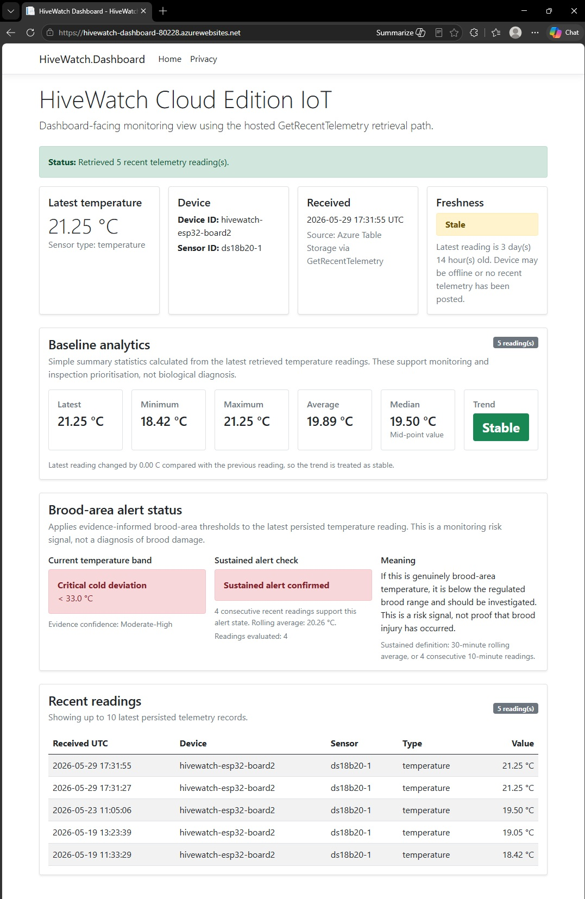

# HiveWatch Cloud Internet of Things (IoT)

HiveWatch Cloud IoT is built around a simple problem: a beekeeper cannot protect what they cannot see between inspections. Inside every productive hive is a nursery called the brood nest. This is where eggs, larvae and developing young bees depend on stable warmth. When that temperature falls, rises or becomes unstable for long enough, the colony may face higher risk of stress, poor development, disease-related problems or other issues that need attention.

HiveWatch gives beekeepers remote visibility across dispersed apiary sites. Using a physical temperature sensor, it captures hive readings, sends them to the cloud, stores the data, and presents recent readings, alert bands, freshness status and baseline analytics on a dashboard that can be checked from home or while on the go.

The system does not diagnose disease, queen failure, brood damage or colony loss. Instead, it gives beekeepers early warning signals so they can decide which hives deserve inspection first and combine remote telemetry with practical judgement at the hive. The goal is simple: fewer blind spots, faster attention and better informed hive management decisions.

---

## At a glance

| Area | Current position |
|---|---|
| Project type | Solo CT-5222 capstone project |
| Main purpose | Remote beehive temperature monitoring for dispersed apiary sites |
| Core sensor | DS18B20 waterproof temperature probe |
| Device layer | ESP32 development board running Arduino/C++ firmware |
| Cloud backend | C#/.NET 8 isolated Azure Functions |
| Storage layer | Azure Table Storage using the `TelemetryReadings` table |
| Retrieval path | Hosted `GetRecentTelemetry` endpoint |
| Dashboard | ASP.NET Core Razor Pages dashboard, validated locally, in Docker and as an Azure-hosted prototype |
| Deployment route | Docker image pushed to Azure Container Registry and hosted through Azure App Service for Containers |
| Current dashboard behaviour | Latest reading, recent readings, fresh or stale state, temperature alert band, sustained-alert data sufficiency and baseline analytics |
| Current validation status | Full bench chain, baseline analytics, local containerisation, Azure-hosted dashboard validation, post-deployment regression, bounded failure-mode evidence, build-and-test CI and targeted dashboard logic tests completed |
| Cost-control position | Dashboard App Service Plan scaled down from B1 Basic to F1 Free after validation for cost control. Basic Azure Container Registry is retained temporarily to reduce rework for later demonstrations and validation checks. |
| Key boundary | Bench-validated and Azure-hosted prototype, not a production hive monitoring system or biological diagnosis tool |

---

## Current validated baseline

The current implementation validates a real physical temperature reading travelling through the complete baseline path:

| Step | Component | Role |
|---:|---|---|
| 1 | DS18B20 waterproof temperature probe | Captures the hive temperature reading |
| 2 | ESP32 firmware | Reads the sensor and prepares the telemetry payload |
| 3 | Wi-Fi and HTTPS POST | Sends the reading from the device to the cloud |
| 4 | Hosted C#/.NET Azure Function | Accepts and validates incoming telemetry |
| 5 | Azure Table Storage | Persists accepted readings in `TelemetryReadings` |
| 6 | Hosted `GetRecentTelemetry` endpoint | Retrieves recent stored telemetry |
| 7 | ASP.NET Core Razor Pages dashboard | Displays latest reading, recent readings, fresh or stale state, alert band and baseline analytics |
| 8 | Docker container image | Packages the dashboard for repeatable container deployment |
| 9 | Azure Container Registry | Stores the dashboard image used by Azure App Service |
| 10 | Azure App Service for Containers | Hosts the dashboard as an Azure web application |
| 11 | GitHub Actions | Builds the Azure Function and dashboard and runs targeted dashboard logic tests |

A live DS18B20 bench reading of `19.50 °C` was captured by the ESP32 device, posted over Wi-Fi and HTTPS to the hosted Azure Function, accepted with HTTP `200`, persisted in Azure Table Storage, retrieved through `GetRecentTelemetry`, and displayed in the Razor Pages dashboard as the latest reading with Fresh status and brood temperature alert classification.

The dashboard was later extended with baseline analytics. It summarises retrieved temperature telemetry using latest, minimum, maximum, average, median, reading count and a simple trend status. The containerised dashboard was also deployed to Azure App Service for Containers and validated as an Azure-hosted prototype.

Following the Azure deployment milestone, a focused evidence-closure sprint was completed. This work revalidated the deployed cloud and dashboard path, added minimal CI and targeted dashboard logic tests, and captured bounded failure-mode evidence for the hosted ingestion endpoint.

The post-deployment regression evidence revalidated the cloud and dashboard projects, physical ESP32-to-Azure ingestion, Azure Table Storage persistence, hosted retrieval, local dashboard rendering, Docker container execution and Azure-hosted dashboard rendering. This supports prototype-level confidence and final demonstration readiness. It does not claim production hardening, live in-hive operation, sustained telemetry reliability, service-level availability or biological diagnosis.

The project was also strengthened with a minimal GitHub Actions build-and-test workflow and targeted xUnit tests for deterministic dashboard service-layer logic. The workflow builds the Azure Function and dashboard projects and runs the dashboard logic tests on pull requests and pushes to `main`.

Bounded failure-mode evidence was added for the hosted `IngestTelemetry` endpoint. Invalid JSON and missing required telemetry field checks both returned HTTP `400` responses. This supports prototype-level failure-mode confidence without claiming production security hardening, service-level availability, malicious traffic resistance or full API test coverage.

---

## How it works

The validated baseline moves a real hive temperature reading through the following path:

```mermaid
flowchart LR
    A["DS18B20 temperature probe"] --> B["ESP32 firmware"]
    B --> C["Wi-Fi and HTTPS POST"]
    C --> D["Hosted C#/.NET Azure Function"]
    D --> E["Azure Table Storage"]
    E --> F["GetRecentTelemetry endpoint"]
    F --> G["ASP.NET Core Razor Pages dashboard"]
    G --> H["Docker container image"]
    H --> I["Azure Container Registry"]
    I --> J["Azure App Service for Containers"]
    J --> K["Hosted dashboard: latest reading, recent readings, fresh or stale status, alert band and baseline analytics"]
```



### Architecture notes

| Layer | Role |
|---|---|
| Sensor | Captures a hive temperature reading using a DS18B20 waterproof probe |
| ESP32 firmware | Reads the probe, prepares a JSON telemetry payload, and sends it over Wi-Fi |
| `IngestTelemetry` | Validates incoming telemetry and stores accepted readings |
| Azure Table Storage | Provides durable storage for accepted telemetry records |
| `GetRecentTelemetry` | Reads back recent stored telemetry for dashboard use |
| Razor Pages dashboard | Displays latest reading, recent readings, fresh or stale state, alert band and baseline analytics |
| Docker container image | Packages the dashboard with a multi-stage .NET 8 build for container deployment |
| Azure Container Registry | Stores the versioned dashboard image for App Service pull |
| Azure App Service for Containers | Hosts the dashboard as a deployed Azure web application |
| GitHub Actions | Provides build-and-test validation for pull requests and pushes to `main` |

---

## Dashboard behaviour

The dashboard displays:

| Dashboard element | Purpose |
|---|---|
| Latest temperature reading | Shows the newest stored hive temperature reading returned by the cloud retrieval path |
| Recent readings table | Shows recent persisted telemetry records |
| Fresh or stale state | Shows whether the latest hive reading still reflects recent telemetry |
| Temperature alert band | Classifies the latest reading against evidence-informed brood nest temperature bands |
| Sustained alert data sufficiency | Separates an immediate out-of-range reading from a sustained alert state requiring enough recent readings |
| Baseline analytics | Summarises retrieved temperature readings using latest, minimum, maximum, average, median, reading count and simple trend status |

The dashboard is read-only and has been validated in three forms:

| Dashboard form | Current status |
|---|---|
| Local Razor Pages dashboard | Validated |
| Local Docker container | Validated |
| Azure App Service for Containers | Validated at prototype smoke-test and post-deployment regression level |

---

## Temperature alert boundary

HiveWatch uses temperature bands as monitoring signals. They help identify when a hive may deserve closer inspection, but they do not prove brood damage, disease, queen failure or colony loss.

Current alert wording is intentionally cautious:

| Reading pattern | Meaning in HiveWatch |
|---|---|
| Temperature outside expected range | The hive may deserve inspection or closer attention |
| Latest reading is stale | The dashboard may no longer reflect current hive conditions |
| Not enough readings for sustained alert | The current value can be classified, but sustained confirmation is not yet available |
| Sustained alert confirmed | Recent readings support an alert state, but this remains a telemetry signal requiring beekeeper judgement |

This boundary matters because a bench temperature reading can validate system behaviour without proving the biological condition of a real hive.

---

## Current status

| Area | Status |
|---|---|
| DS18B20 sensor detection | Validated |
| Live local temperature readings | Validated |
| ESP32 Wi-Fi connectivity | Validated |
| Remote telemetry POST smoke test | Validated |
| Azure Function ingestion endpoint | Validated |
| ESP32 to hosted Azure Function telemetry POST | Validated |
| Accepted telemetry to Azure Table Storage persistence | Validated |
| Latest and recent stored telemetry retrieval endpoint | Validated |
| Local dashboard latest reading view | Validated |
| Local dashboard recent readings table | Validated |
| Local dashboard fresh or stale state | Validated |
| Local dashboard brood temperature alert status | Validated |
| Fresh full chain bench validation | Validated |
| Dashboard baseline analytics | Validated |
| Expansion-board DS18B20 revalidation | Validated |
| Local dashboard containerisation | Validated |
| Azure dashboard deployment | Validated at prototype level and cost-controlled on F1 Free |
| Post-deployment regression evidence | Validated |
| Build-and-test CI | Minimal GitHub Actions workflow added and validated |
| Targeted automated tests | Added for deterministic dashboard alert and analytics logic |
| Bounded failure-mode evidence | Validated for invalid JSON and missing required telemetry fields |
| Sustained telemetry validation | Future milestone |

---

## Validation evidence

### Post-deployment regression validation

The post-deployment regression evidence is stored in [`docs/evidence/2026-07-05-post-deployment-regression/`](docs/evidence/2026-07-05-post-deployment-regression/).

| Evidence artefact | What it demonstrates |
|---|---|
| [`serial-monitor-ingestion-regression-2026-07-05.jpg`](docs/evidence/2026-07-05-post-deployment-regression/serial-monitor-ingestion-regression-2026-07-05.jpg) | ESP32 Board 2, DS18B20 reading, JSON payload, hosted POST and HTTP `200` response |
| [`azure-table-storage-persistence-regression-2026-07-05.jpg`](docs/evidence/2026-07-05-post-deployment-regression/azure-table-storage-persistence-regression-2026-07-05.jpg) | New telemetry row persisted in Azure Table Storage |
| [`get-recent-telemetry-retrieval-regression-2026-07-05.jpg`](docs/evidence/2026-07-05-post-deployment-regression/get-recent-telemetry-retrieval-regression-2026-07-05.jpg) | Hosted retrieval endpoint returning recent telemetry |
| [`invalid-limit-retrieval-regression-2026-07-05.jpg`](docs/evidence/2026-07-05-post-deployment-regression/invalid-limit-retrieval-regression-2026-07-05.jpg) | Invalid retrieval `limit` handled with HTTP `400` |
| [`dashboard-local-ui-regression-2026-07-05.jpg`](docs/evidence/2026-07-05-post-deployment-regression/dashboard-local-ui-regression-2026-07-05.jpg) | Local dashboard rendering latest reading, freshness, alert and analytics panels |
| [`docker-image-build-regression-2026-07-05.jpg`](docs/evidence/2026-07-05-post-deployment-regression/docker-image-build-regression-2026-07-05.jpg) | Dashboard Docker image built successfully |
| [`docker-container-runtime-regression-2026-07-05.jpg`](docs/evidence/2026-07-05-post-deployment-regression/docker-container-runtime-regression-2026-07-05.jpg) | Dashboard container running locally and returning HTTP `200` |
| [`dashboard-docker-ui-regression-2026-07-05.jpg`](docs/evidence/2026-07-05-post-deployment-regression/dashboard-docker-ui-regression-2026-07-05.jpg) | Docker-hosted dashboard rendering correctly |
| [`azure-hosted-dashboard-ui-regression-2026-07-05.jpg`](docs/evidence/2026-07-05-post-deployment-regression/azure-hosted-dashboard-ui-regression-2026-07-05.jpg) | Azure-hosted dashboard rendering correctly after deployment |
| [`post-deployment-regression-evidence-note.txt`](docs/evidence/2026-07-05-post-deployment-regression/post-deployment-regression-evidence-note.txt) | Text note summarising regression scope, evidence and prototype boundary |

### Bounded failure-mode validation

The bounded failure-mode evidence is stored in [`docs/evidence/2026-07-07-bounded-failure-mode-evidence/`](docs/evidence/2026-07-07-bounded-failure-mode-evidence/).

| Evidence artefact | What it demonstrates |
|---|---|
| [`bounded-failure-mode-terminal-output-2026-07-07.txt`](docs/evidence/2026-07-07-bounded-failure-mode-evidence/bounded-failure-mode-terminal-output-2026-07-07.txt) | Hosted `IngestTelemetry` rejected invalid JSON and missing required telemetry fields with HTTP `400` responses |
| [`bounded-failure-mode-evidence-note.txt`](docs/evidence/2026-07-07-bounded-failure-mode-evidence/bounded-failure-mode-evidence-note.txt) | Summarises scope, purpose, endpoint handling and prototype boundary for the bounded failure-mode evidence |

### CI and automated test validation

The repository now includes a GitHub Actions workflow at [`.github/workflows/dotnet-build.yml`](.github/workflows/dotnet-build.yml).

The workflow currently:

| Workflow step | Purpose |
|---|---|
| Setup .NET 8 | Prepares the GitHub-hosted runner |
| Build Azure Function | Builds the telemetry ingestor project in Release configuration |
| Build dashboard | Builds the Razor Pages dashboard in Release configuration |
| Test dashboard logic | Runs targeted xUnit tests for dashboard service-layer logic |

The dashboard test suite is stored in [`dashboard/HiveWatch.Dashboard.Tests/`](dashboard/HiveWatch.Dashboard.Tests/).

Current targeted tests cover:

| Test area | Behaviour covered |
|---|---|
| No telemetry | Safe empty-state behaviour |
| Brood temperature alert classification | Cold deviation and reference-range classification |
| Sustained-alert behaviour | Not enough data versus confirmed sustained alert |
| Telemetry analytics | Count, latest, minimum, maximum, average and median |
| Trend classification | Rising, stable and falling trend states |

### Azure dashboard deployment validation

The Azure dashboard deployment evidence is stored in:

```text
docs/evidence/2026-06-02-azure-dashboard-deployment/
```

| Evidence artefact | What it demonstrates |
|---|---|
| [`2026-06-02-hivewatch-dashboard-azure-app-service-validation.jpg`](docs/evidence/2026-06-02-azure-dashboard-deployment/2026-06-02-hivewatch-dashboard-azure-app-service-validation.jpg) | Hosted Azure dashboard rendered over HTTPS with latest temperature, freshness, baseline analytics, brood-area alert status and recent readings |
| [`2026-06-02-azure-hosted-dashboard-terminal-validation-redacted.jpg`](docs/evidence/2026-06-02-azure-dashboard-deployment/2026-06-02-azure-hosted-dashboard-terminal-validation-redacted.jpg) | Redacted terminal evidence showing Azure Web App status, container configuration, app setting names and HTTP `200 OK` response |
| [`azure-dashboard-deployment-evidence-note.txt`](docs/evidence/2026-06-02-azure-dashboard-deployment/azure-dashboard-deployment-evidence-note.txt) | Text evidence note summarising hosted deployment, HTTP `200 OK`, Kestrel response, App Service container state, ACR managed identity pull and dashboard panel rendering |



### Expansion-board DS18B20 revalidation

The expansion-board revalidation evidence is stored in:

```text
docs/evidence/2026-05-29-expansion-board-ds18b20-revalidation/
```

| Evidence artefact | What it demonstrates |
|---|---|
| Expansion-board evidence images | ESP32 Board 2 remained able to detect the DS18B20, capture a `21.25 °C` reading, POST to the hosted Azure Function, persist to Azure Table Storage and render through the dashboard after the hardware layout change |

### Baseline analytics validation

The baseline analytics evidence is stored in:

```text
docs/evidence/2026-05-25-baseline-analytics/
```

| Evidence artefact | What it demonstrates |
|---|---|
| [`dashboard-baseline-analytics.jpg`](docs/evidence/2026-05-25-baseline-analytics/dashboard-baseline-analytics.jpg) | Local dashboard baseline analytics panel showing latest, minimum, maximum, average, median, trend, recent readings and alert context |

### Fresh full chain validation

The fresh validation evidence is stored in:

```text
docs/evidence/2026-05-23-fresh-full-chain-validation/
```

| Evidence artefact | What it demonstrates |
|---|---|
| [`serial-monitor-success.jpg`](docs/evidence/2026-05-23-fresh-full-chain-validation/serial-monitor-success.jpg) | ESP32 Wi-Fi connection, DS18B20 reading, JSON payload, hosted Azure Function POST, HTTP `200` response and accepted telemetry |
| [`azure-table-storage-row.jpg`](docs/evidence/2026-05-23-fresh-full-chain-validation/azure-table-storage-row.jpg) | New `19.5 °C` telemetry row persisted in Azure Table Storage |
| [`dashboard-fresh-alert-status.jpg`](docs/evidence/2026-05-23-fresh-full-chain-validation/dashboard-fresh-alert-status.jpg) | Dashboard retrieved the fresh row, displayed Fresh status, showed recent readings and classified the alert band |

### Earlier staged validation evidence

| Evidence | Screenshot |
|---|---|
| ESP32 and DS18B20 temperature probe bench setup | [`docs/images/esp32-ds18b20-bench-setup.jpg`](docs/images/esp32-ds18b20-bench-setup.jpg) |
| Hosted Azure Function telemetry POST success | [`docs/images/azure-function-post-success.jpg`](docs/images/azure-function-post-success.jpg) |
| Azure Table Storage persistence | [`docs/images/azure-table-persistence.jpg`](docs/images/azure-table-persistence.jpg) |
| Local dashboard recent readings and fresh or stale state | [`docs/images/dashboard-recent-readings-freshness.jpg`](docs/images/dashboard-recent-readings-freshness.jpg) |
| Local dashboard brood temperature alert status | [`docs/images/dashboard-brood-alert-status.jpg`](docs/images/dashboard-brood-alert-status.jpg) |

---

## Technology stack

| Area | Technologies used |
|---|---|
| Device and firmware | ESP32 development board, Arduino IDE, Arduino/C++ sketches |
| Sensor layer | DS18B20 waterproof temperature probe, OneWire library, DallasTemperature library |
| Connectivity and payload | Wi-Fi, HTTP/HTTPS POST, JSON telemetry payloads |
| Cloud backend | Azure Functions, Azure Table Storage, .NET 8 isolated worker model, C# |
| Storage integration | Azure.Data.Tables client library, `TelemetryReadings` table |
| Retrieval path | HTTP GET Function endpoint, latest and recent stored telemetry JSON read back |
| Dashboard | ASP.NET Core Razor Pages, typed `HttpClient`, Bootstrap-based Razor Pages UI |
| Dashboard logic tests | xUnit, Microsoft.NET.Test.Sdk, deterministic service-layer tests |
| CI validation | GitHub Actions build-and-test workflow |
| Containerisation | Docker Desktop, multi-stage .NET 8 Dockerfile, root `.dockerignore`, local dashboard image build |
| Azure dashboard hosting | Azure Container Registry, Azure App Service for Containers, Linux Web App, App Service Plan, managed identity, AcrPull, Azure CLI |
| Validation and integration testing | Arduino Serial Monitor, Webhook.site remote POST smoke test, PowerShell REST checks, Azure Table Storage inspection, local browser checks, Docker runtime checks, hosted Azure HTTP smoke checks |
| Version control | Git, GitHub branches, pull requests and evidence commits |

---

## Firmware validation sequence

The firmware proofs are retained in the order used to reduce implementation risk.

| Stage | Purpose |
|---|---|
| [`01_one_wire_scanner_test`](firmware/proofs/01_one_wire_scanner_test) | Detect the DS18B20 probe on the 1-Wire bus |
| [`02_live_temperature_readings`](firmware/proofs/02_live_temperature_readings) | Produce live local temperature readings in the Serial Monitor |
| [`03_wifi_connection_only_test`](firmware/proofs/03_wifi_connection_only_test) | Prove ESP32 Wi-Fi connectivity independently of the sensor |
| [`04_remote_webhook_telemetry_smoke_test`](firmware/proofs/04_remote_webhook_telemetry_smoke_test) | POST live temperature telemetry to a temporary Webhook.site endpoint |
| [`05_local_azure_function_post_test`](firmware/proofs/05_local_azure_function_post_test) | Test the device-side POST shape against a laptop-local Azure Function route during integration work |
| [`06_hosted_azure_function_post_test`](firmware/proofs/06_hosted_azure_function_post_test) | POST live temperature telemetry to the hosted Azure Function endpoint |

This staged approach keeps the project traceable and makes the progression from device validation to cloud ingestion explicit.

---

## Azure Function endpoints

The cloud component is a .NET 8 isolated Azure Function project containing two HTTP-triggered endpoints.

```text
IngestTelemetry
GetRecentTelemetry
```

### `IngestTelemetry`

The ingestion endpoint currently:

| Behaviour | Status |
|---|---|
| Accepts HTTP POST requests | Implemented |
| Deserialises incoming telemetry JSON | Implemented |
| Validates required fields | Implemented |
| Persists accepted telemetry to Azure Table Storage | Implemented |
| Returns a structured accepted response only after persistence succeeds | Implemented |
| Returns a server-side error response if valid telemetry cannot be stored | Implemented |

Example telemetry payload shape:

```json
{
  "device_id": "hivewatch-esp32-device",
  "sensor_id": "ds18b20-1",
  "type": "temperature",
  "unit": "C",
  "value": 19.50
}
```

Example accepted response shape:

```json
{
  "status": "accepted",
  "received_at_utc": "ISO-8601 UTC timestamp",
  "telemetry": {
    "device_id": "hivewatch-esp32-device",
    "sensor_id": "ds18b20-1",
    "type": "temperature",
    "unit": "C",
    "value": 19.50
  }
}
```

### `GetRecentTelemetry`

The retrieval endpoint currently:

| Behaviour | Status |
|---|---|
| Accepts HTTP GET requests | Implemented |
| Reads stored telemetry from Azure Table Storage | Implemented |
| Orders readings by `ReceivedAtUtc` from newest to oldest | Implemented |
| Returns a default of 20 readings if no `limit` is supplied | Implemented |
| Accepts a positive whole number `limit` query parameter | Implemented |
| Enforces an internal maximum of 100 readings | Implemented |
| Rejects invalid `limit` values with HTTP `400 Bad Request` | Implemented |

Example retrieval route:

```text
GET /api/GetRecentTelemetry?limit=10
```

Example retrieval response shape:

```json
{
  "status": "ok",
  "count": 3,
  "readings": [
    {
      "deviceId": "hivewatch-esp32-device",
      "sensorId": "ds18b20-1",
      "type": "temperature",
      "unit": "C",
      "value": 19.50,
      "receivedAtUtc": "ISO-8601 UTC timestamp"
    }
  ]
}
```

---

## Container and Azure dashboard deployment

The dashboard includes a Dockerfile at:

```text
dashboard/HiveWatch.Dashboard/Dockerfile
```

The Dockerfile uses a multi-stage .NET 8 build. The SDK image restores and publishes the dashboard, and the ASP.NET runtime image runs `HiveWatch.Dashboard.dll` on port `8080`.

Example local image build:

```powershell
docker build -f dashboard/HiveWatch.Dashboard/Dockerfile -t hivewatch-dashboard:local .
```

Example local container run shape, with the telemetry endpoint supplied at runtime rather than committed:

```powershell
docker run -d `
  --name hivewatch-dashboard-local `
  -p 8080:8080 `
  -e TelemetryApi__RecentTelemetryUrl="<configured endpoint>" `
  hivewatch-dashboard:local
```

For Azure deployment, the dashboard image was tagged and pushed to Azure Container Registry, then hosted through Azure App Service for Containers. The Web App pulls from the registry using a system-assigned managed identity with `AcrPull`, rather than enabling ACR admin credentials.

After hosted validation, the App Service Plan was scaled from B1 Basic to F1 Free to protect Azure student credit while preserving the deployed configuration for light follow-up checks.

---

## Repository layout

```text
hivewatch-cloud-iot/
|-- .github/
|   `-- workflows/
|       `-- dotnet-build.yml
|-- cloud/
|   |-- HiveWatch.TelemetryIngestor.slnx
|   `-- HiveWatch.TelemetryIngestor/
|-- dashboard/
|   |-- HiveWatch.Dashboard.slnx
|   |-- HiveWatch.Dashboard/
|   |   `-- Dockerfile
|   `-- HiveWatch.Dashboard.Tests/
|-- docs/
|   |-- evidence/
|   |   |-- 2026-05-23-fresh-full-chain-validation/
|   |   |-- 2026-05-25-baseline-analytics/
|   |   |-- 2026-05-29-expansion-board-ds18b20-revalidation/
|   |   |-- 2026-06-02-azure-dashboard-deployment/
|   |   |-- 2026-07-05-post-deployment-regression/
|   |   `-- 2026-07-07-bounded-failure-mode-evidence/
|   `-- images/
|-- firmware/
|   `-- proofs/
|-- .dockerignore
|-- .gitignore
`-- README.md
```

---

## Configuration and security notes

This repository is prepared for public sharing and intentionally excludes local or secret-bearing configuration.

Placeholder values are used for:

| Placeholder type | Reason |
|---|---|
| Wi-Fi network credentials | Prevents private network details being committed |
| Temporary Webhook.site URLs | Prevents obsolete external test URLs being treated as production endpoints |
| Hosted Azure Function endpoint URLs | Avoids exposing live endpoint details in public source files |
| Storage connection strings | Prevents access to private Azure resources |
| Dashboard telemetry retrieval URL | Kept as runtime configuration, not committed source |

The Azure Function expects runtime configuration for:

| Setting | Purpose |
|---|---|
| `TelemetryStorageConnectionString` | Required Azure Storage connection string |
| `TelemetryTableName` | Optional table name override. The code defaults to `TelemetryReadings` |

The dashboard expects runtime configuration for:

| Setting | Purpose |
|---|---|
| `TelemetryApi:RecentTelemetryUrl` | Local .NET configuration key for the hosted retrieval endpoint |
| `TelemetryApi__RecentTelemetryUrl` | Environment-variable/App Service form of the same setting |
| `WEBSITES_PORT` | Azure App Service setting used to route traffic to the container port, set to `8080` during validation |

These values are configured locally through ignored settings, .NET user secrets or hosted Azure App settings. They are not committed to the repository.

Some proof-of-concept firmware sketches use:

```cpp
secureClient.setInsecure();
```

This kept early HTTPS smoke tests simple. A hardened production version would use proper certificate validation.

---

## Remaining baseline work

The next development steps are sustained telemetry validation and final submission preparation, not proving the core chain again.

| Priority | Next work |
|---|---|
| 1 | Prepare, execute and analyse a sustained bench telemetry run |
| 2 | Update project-control records after sustained telemetry validation and evidence closure |
| 3 | Prepare final demonstration assets and demo script |
| 4 | Complete Final Report evidence mapping and final submission checks |

The project now has a validated technical baseline, Azure-hosted dashboard evidence, post-deployment regression evidence, bounded failure-mode evidence, minimal build-and-test CI and targeted dashboard logic tests. The next phase is sustained telemetry validation, final presentation readiness and Final Report evidence mapping.

---

## Project direction

HiveWatch Cloud IoT now has a working baseline across physical sensing, embedded firmware, cloud ingestion, cloud persistence, hosted retrieval, dashboard display, baseline analytics, Docker containerisation, Azure App Service hosted dashboard validation, post-deployment regression, bounded failure-mode evidence and automated build-and-test checks.

The project will now mature toward sustained telemetry validation, final demonstration preparation and Final Report evidence mapping. Heavier items such as Azure IoT Hub, Cosmos DB, Terraform, external notifications and extra sensors remain stretch goals until the core monitoring system is stable, validated and ready for demonstration.
