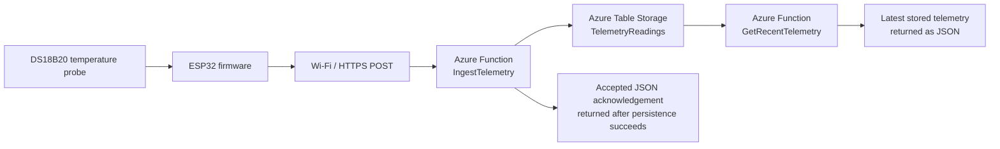
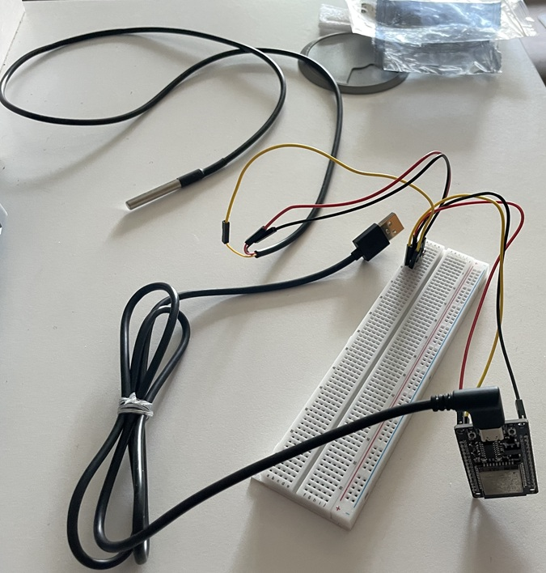
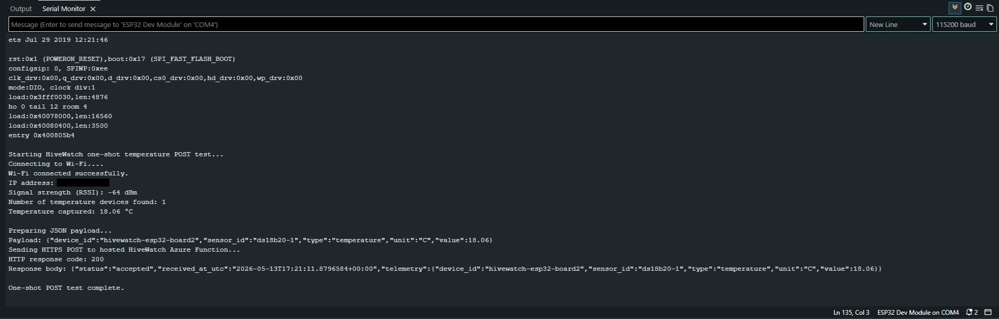
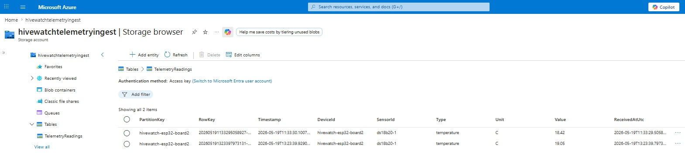

# HiveWatch Cloud Internet of Things (IoT)

HiveWatch Cloud IoT is a cloud-connected beehive monitoring capstone project.  
The current implementation focuses on a validated temperature telemetry path using:

- An ESP32 development board
- A waterproof DS18B20 temperature probe
- Staged firmware proofs
- A .NET 8 isolated Azure Function backend
- Azure Table Storage for durable telemetry persistence
- A hosted read-back endpoint for the latest stored telemetry

The project is being developed in technical stages, with each layer tested before moving to the next.

---

## Current validated baseline

The repository currently captures a completed device-to-cloud proof-of-concept path for:

> **Live DS18B20 temperature reading -> ESP32 -> Wi-Fi / HTTPS -> hosted Azure Function ingestion endpoint**

It also captures a validated cloud persistence path for:

> **Valid telemetry payload -> hosted Azure Function -> Azure Table Storage**

The hosted Azure Function accepts a JSON telemetry payload, validates the required fields, persists accepted telemetry to Azure Table Storage, and then returns a structured acknowledgement.

The repository now also captures a validated telemetry read-back path for:

> **Azure Table Storage -> hosted Azure Function retrieval endpoint -> latest stored telemetry returned as JSON**

In this proof of concept, “recent” retrieval means the latest stored telemetry rows ordered by `ReceivedAtUtc` in descending order. It does not yet represent a fixed time-window query such as “last 24 hours”.

### Current status

| Area | Status |
|---|---|
| DS18B20 sensor detection | Validated |
| Live local temperature readings | Validated |
| ESP32 Wi-Fi connectivity | Validated |
| Remote telemetry POST smoke test | Validated |
| Azure Function ingestion endpoint | Validated |
| ESP32 -> hosted Azure Function telemetry POST | Validated |
| Accepted telemetry -> Azure Table Storage persistence | Validated through local and hosted Function API checks |
| Latest stored telemetry retrieval endpoint | Validated through local and hosted Function GET checks |
| Dashboard foundation / visualisation | Next milestone |

---

## Tech stack

| Area | Technologies used |
|---|---|
| Device and firmware | ESP32 development board, Arduino IDE, Arduino/C++ sketches |
| Sensor layer | DS18B20 waterproof temperature probe, OneWire library, DallasTemperature library |
| Connectivity and payload | Wi-Fi, HTTP/HTTPS POST, JSON telemetry payloads |
| Cloud backend | Azure Functions, Azure Table Storage, .NET 8 isolated worker model, C# |
| Storage integration | Azure.Data.Tables client library, `TelemetryReadings` table |
| Retrieval path | HTTP GET Function endpoint, latest stored telemetry JSON read-back |
| Validation and integration testing | Arduino Serial Monitor, Webhook.site remote POST smoke test, PowerShell REST checks, Azure Table Storage inspection |
| Version control | Git and GitHub |

---

## Current telemetry architecture



The cloud ingestion path, Azure Table Storage persistence path, and latest stored telemetry retrieval path have now been demonstrated in staged proof points.  
The next milestone is to use the retrievable telemetry as the foundation for dashboard development and monitoring views.

---

## Validation evidence

### Bench prototype



The current device-layer proof uses a real ESP32 board wired to a waterproof DS18B20 temperature probe on a breadboard.

### Hosted Azure Function telemetry POST success



This test run shows the ESP32 capturing a live DS18B20 temperature reading, posting it to the hosted Azure Function ingestion endpoint, receiving HTTP `200`, and getting a structured `"status":"accepted"` response.

### Azure Table Storage persistence confirmed



The persistence milestone has now been validated through both local and hosted Function API checks.  
A hosted PowerShell POST returned `accepted`, and the accepted telemetry was confirmed as stored rows in the Azure Table Storage `TelemetryReadings` table.

### Latest stored telemetry retrieval confirmed

The hosted `GetRecentTelemetry` endpoint has now been validated against the existing persisted Azure Table Storage readings.

- `GET /api/GetRecentTelemetry?limit=10` returned both stored telemetry rows
- `GET /api/GetRecentTelemetry?limit=1` returned only the most recently stored reading
- `GET /api/GetRecentTelemetry?limit=0` returned HTTP `400 Bad Request`

This establishes the read-back foundation needed for the planned dashboard path.

---

## Repository layout

```text
hivewatch-cloud-iot/
├── cloud/
│   ├── HiveWatch.TelemetryIngestor.slnx
│   └── HiveWatch.TelemetryIngestor/
│       ├── Function1.cs
│       ├── Program.cs
│       ├── host.json
│       ├── HiveWatch.TelemetryIngestor.csproj
│       ├── Models/
│       │   ├── TelemetryReading.cs
│       │   ├── TelemetryReadingRecord.cs
│       │   └── TelemetryTableEntity.cs
│       ├── Services/
│       │   └── TelemetryStorageService.cs
│       └── Properties/
│           └── launchSettings.json
│
├── docs/
│   └── images/
│       ├── azure-table-persistence.jpg
│       ├── azure-function-post-success.jpg
│       └── esp32-ds18b20-bench-setup.jpg
│
├── firmware/
│   └── proofs/
│       ├── 01_one_wire_scanner_test/
│       ├── 02_live_temperature_readings/
│       ├── 03_wifi_connection_only_test/
│       ├── 04_remote_webhook_telemetry_smoke_test/
│       ├── 05_local_azure_function_post_test/
│       └── 06_hosted_azure_function_post_test/
│
├── .gitignore
└── README.md
```

---

## Firmware validation sequence

The firmware proofs are retained in the order they were used to de-risk the system.

| Stage | Purpose |
|---|---|
| `01_one_wire_scanner_test` | Detect the DS18B20 probe on the 1-Wire bus |
| `02_live_temperature_readings` | Produce live local temperature readings in the Serial Monitor |
| `03_wifi_connection_only_test` | Prove ESP32 Wi-Fi connectivity independently of the sensor |
| `04_remote_webhook_telemetry_smoke_test` | POST live temperature telemetry to a temporary Webhook.site endpoint |
| `05_local_azure_function_post_test` | Test the device-side POST shape against a laptop-local Azure Function route during integration work |
| `06_hosted_azure_function_post_test` | Successfully POST live temperature telemetry to the hosted Azure Function endpoint |

This staged approach keeps the project traceable and makes the progression from device validation to cloud ingestion explicit.

---

## Azure Function ingestion, persistence, and retrieval endpoints

The current cloud component is a .NET 8 isolated Azure Function project containing two HTTP-triggered endpoints:

```text
IngestTelemetry
GetRecentTelemetry
```

### `IngestTelemetry`

The ingestion endpoint currently:

- Accepts HTTP `POST` requests
- Deserialises the incoming telemetry JSON
- Validates required fields
- Persists accepted telemetry to Azure Table Storage
- Returns a structured `accepted` response only after persistence succeeds
- Returns a server-side error response if valid telemetry cannot be stored

#### Example telemetry payload

```json
{
  "device_id": "hivewatch-esp32-board2",
  "sensor_id": "ds18b20-1",
  "type": "temperature",
  "unit": "C",
  "value": 18.06
}
```

#### Example accepted response shape

```json
{
  "status": "accepted",
  "received_at_utc": "<server timestamp>",
  "telemetry": {
    "device_id": "hivewatch-esp32-board2",
    "sensor_id": "ds18b20-1",
    "type": "temperature",
    "unit": "C",
    "value": 18.06
  }
}
```

### `GetRecentTelemetry`

The retrieval endpoint currently:

- Accepts HTTP `GET` requests
- Reads stored telemetry from Azure Table Storage
- Orders readings by `ReceivedAtUtc` from newest to oldest
- Returns a default of 20 readings if no `limit` is supplied
- Accepts a positive whole-number `limit` query parameter
- Enforces an internal maximum of 100 readings
- Rejects invalid `limit` values with HTTP `400 Bad Request`

#### Example retrieval route

```text
GET /api/GetRecentTelemetry?limit=10
```

#### Example retrieval response shape

```json
{
  "status": "ok",
  "count": 2,
  "readings": [
    {
      "deviceId": "hivewatch-esp32-board2",
      "sensorId": "ds18b20-1",
      "type": "temperature",
      "unit": "C",
      "value": 19.05,
      "receivedAtUtc": "2026-05-19T13:23:39.7973131+00:00"
    },
    {
      "deviceId": "hivewatch-esp32-board2",
      "sensorId": "ds18b20-1",
      "type": "temperature",
      "unit": "C",
      "value": 18.42,
      "receivedAtUtc": "2026-05-19T11:33:29.5058927+00:00"
    }
  ]
}
```

---

## Configuration and security notes

This repository is prepared for public sharing and intentionally excludes local or secret-bearing configuration.

### Placeholder values are used for:

- Wi-Fi network credentials
- Temporary Webhook.site URLs
- Hosted Azure Function endpoint URLs

### Runtime settings used for telemetry persistence and retrieval

The Azure Function expects runtime configuration for:

- `TelemetryStorageConnectionString` — required Azure Storage connection string
- `TelemetryTableName` — optional table name override; the code defaults to `TelemetryReadings`

These values are configured locally through ignored settings files or in hosted Azure Function App environment settings. They are not committed to the repository.

### Excluded from version control:

- `local.settings.json`
- Visual Studio user files
- Build outputs such as `bin/` and `obj/`
- Publish profiles and local deployment metadata

Some proof-of-concept firmware sketches use:

```cpp
secureClient.setInsecure();
```

This kept the early HTTPS smoke tests simple. A hardened version would use proper certificate validation.

---

## Next planned milestone

The next development step is:

> **Build the first dashboard-facing read path and monitoring view using the now-retrievable stored telemetry.**

This will extend the current system from:

> **validated cloud ingestion, durable persistence, and latest stored telemetry read-back**

to:

> **stored telemetry surfaced through the planned dashboard layer for monitoring and later analytics work**

and will move the project closer to its demonstration-ready web application layer.

---

## Project direction

HiveWatch Cloud IoT now has an established technical baseline: a real DS18B20 temperature probe, an ESP32 device capable of Wi-Fi telemetry transmission, a hosted Azure Function ingestion endpoint demonstrated end to end, Azure Table Storage persistence for accepted telemetry, and a hosted retrieval endpoint that reads back the latest stored telemetry.

The next milestone is dashboard foundation and visualisation, building on the validated ingestion, storage, and retrieval layers.
