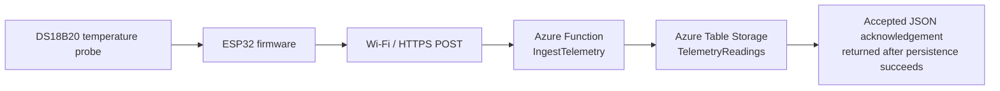

# HiveWatch Cloud Internet of Things (IoT)

HiveWatch Cloud IoT is a cloud-connected beehive monitoring capstone project.  
The current implementation focuses on a validated temperature telemetry path using:

- An ESP32 development board
- A waterproof DS18B20 temperature probe
- Staged firmware proofs
- A .NET 8 isolated Azure Function ingestion endpoint
- Azure Table Storage for durable telemetry persistence

The project is being developed in technical stages, with each layer tested before moving to the next.

---

## Current validated baseline

The repository currently captures a completed device-to-cloud proof-of-concept path for:

> **Live DS18B20 temperature reading -> ESP32 -> Wi-Fi / HTTPS -> hosted Azure Function ingestion endpoint**

It also now captures a validated cloud persistence path for:

> **Valid telemetry payload -> hosted Azure Function -> Azure Table Storage**

The hosted Azure Function accepts a JSON telemetry payload, validates the required fields, persists accepted telemetry to Azure Table Storage, and then returns a structured acknowledgement.

### Current status

| Area | Status |
|---|---|
| DS18B20 sensor detection | Validated |
| Live local temperature readings | Validated |
| ESP32 Wi-Fi connectivity | Validated |
| Remote telemetry POST smoke test | Validated |
| Azure Function ingestion endpoint | Validated |
| ESP32 -> hosted Azure Function telemetry POST | Validated |
| Accepted telemetry -> Azure Table Storage persistence | Validated through local and hosted Function API checks |
| Dashboard retrieval / visualisation | Next milestone |

---

## Tech stack

| Area | Technologies used |
|---|---|
| Device and firmware | ESP32 development board, Arduino IDE, Arduino/C++ sketches |
| Sensor layer | DS18B20 waterproof temperature probe, OneWire library, DallasTemperature library |
| Connectivity and payload | Wi-Fi, HTTP/HTTPS POST, JSON telemetry payloads |
| Cloud backend | Azure Functions, Azure Table Storage, .NET 8 isolated worker model, C# |
| Storage integration | Azure.Data.Tables client library, `TelemetryReadings` table |
| Validation and integration testing | Arduino Serial Monitor, Webhook.site remote POST smoke test, PowerShell REST checks, Azure Table Storage inspection |
| Version control | Git and GitHub |

---

## Current telemetry architecture



The cloud ingestion path and Azure Table Storage persistence path have now both been demonstrated.  
The next proof-of-concept milestone is to **retrieve stored telemetry for recent/historical inspection and dashboard visualisation**.

---

## Validation evidence

### Bench prototype


The current device-layer proof uses a real ESP32 board wired to a waterproof DS18B20 temperature probe on a breadboard.

### Hosted Azure Function telemetry POST success


This test run shows the ESP32 capturing a live DS18B20 temperature reading, posting it to the hosted Azure Function ingestion endpoint, receiving HTTP `200`, and getting a structured `"status":"accepted"` response.

### Azure Table Storage persistence confirmed


The persistence milestone has now been validated through both local and hosted Function API checks.  
A hosted PowerShell POST returned `accepted`, and the accepted telemetry was confirmed as stored rows in the Azure Table Storage `TelemetryReadings` table.

---

## Repository layout

```text
hivewatch-cloud-iot/
├── cloud/
│   ├── HiveWatch.TelemetryIngestor.slnx
│   └── HiveWatch.TelemetryIngestor/
│       ├── Function1.cs
│       ├── Program.cs
│       ├── host.json
│       ├── HiveWatch.TelemetryIngestor.csproj
│       ├── Models/
│       │   ├── TelemetryReading.cs
│       │   └── TelemetryTableEntity.cs
│       ├── Services/
│       │   └── TelemetryStorageService.cs
│       └── Properties/
│           └── launchSettings.json
│
├── docs/
│   └── images/
│       ├── azure-table-persistence.jpg
│       ├── azure-function-post-success.jpg
│       └── esp32-ds18b20-bench-setup.jpg
│
├── firmware/
│   └── proofs/
│       ├── 01_one_wire_scanner_test/
│       ├── 02_live_temperature_readings/
│       ├── 03_wifi_connection_only_test/
│       ├── 04_remote_webhook_telemetry_smoke_test/
│       ├── 05_local_azure_function_post_test/
│       └── 06_hosted_azure_function_post_test/
│
├── .gitignore
└── README.md
```

---

## Firmware validation sequence

The firmware proofs are retained in the order they were used to de-risk the system.

| Stage | Purpose |
|---|---|
| `01_one_wire_scanner_test` | Detect the DS18B20 probe on the 1-Wire bus |
| `02_live_temperature_readings` | Produce live local temperature readings in the Serial Monitor |
| `03_wifi_connection_only_test` | Prove ESP32 Wi-Fi connectivity independently of the sensor |
| `04_remote_webhook_telemetry_smoke_test` | POST live temperature telemetry to a temporary Webhook.site endpoint |
| `05_local_azure_function_post_test` | Test the device-side POST shape against a laptop-local Azure Function route during integration work |
| `06_hosted_azure_function_post_test` | Successfully POST live temperature telemetry to the hosted Azure Function endpoint |

This staged approach keeps the project traceable and makes the progression from device validation to cloud ingestion explicit.

---

## Azure Function ingestion and persistence endpoint

The current cloud component is a .NET 8 isolated Azure Function project containing an HTTP-triggered ingestion endpoint:

```text
IngestTelemetry
```

The function currently:

- Accepts HTTP `POST` requests
- Deserialises the incoming telemetry JSON
- Validates required fields
- Persists accepted telemetry to Azure Table Storage
- Returns a structured `accepted` response only after persistence succeeds
- Returns a server-side error response if valid telemetry cannot be stored

### Example telemetry payload

```json
{
  "device_id": "hivewatch-esp32-board2",
  "sensor_id": "ds18b20-1",
  "type": "temperature",
  "unit": "C",
  "value": 18.06
}
```

### Example accepted response shape

```json
{
  "status": "accepted",
  "received_at_utc": "<server timestamp>",
  "telemetry": {
    "device_id": "hivewatch-esp32-board2",
    "sensor_id": "ds18b20-1",
    "type": "temperature",
    "unit": "C",
    "value": 18.06
  }
}
```

---

## Configuration and security notes

This repository is prepared for public sharing and intentionally excludes local or secret-bearing configuration.

### Placeholder values are used for:

- Wi-Fi network credentials
- Temporary Webhook.site URLs
- Hosted Azure Function endpoint URLs

### Runtime settings used for telemetry persistence

The persistence-enabled Function expects runtime configuration for:

- `TelemetryStorageConnectionString` — required Azure Storage connection string
- `TelemetryTableName` — optional table name override; the code defaults to `TelemetryReadings`

These values are configured locally through ignored settings files or in hosted Azure Function App environment settings. They are not committed to the repository.

### Excluded from version control:

- `local.settings.json`
- Visual Studio user files
- Build outputs such as `bin/` and `obj/`
- Publish profiles and local deployment metadata

Some proof-of-concept firmware sketches use:

```cpp
secureClient.setInsecure();
```

This kept the early HTTPS smoke tests simple. A hardened version would use proper certificate validation.

---

## Next planned milestone

The next development step is:

> **Retrieve persisted temperature telemetry from Azure storage and expose it for recent/historical review through a retrieval and dashboard path.**

This will extend the current system from:

> **validated and durable cloud telemetry persistence**

to:

> **retrievable telemetry that can support monitoring views and later dashboard visualisation**

and will move the project closer to its demonstration-ready monitoring layer.

---

## Project direction

HiveWatch Cloud IoT now has an established technical baseline: a real DS18B20 temperature probe, an ESP32 device capable of Wi-Fi telemetry transmission, a hosted Azure Function ingestion endpoint demonstrated end to end, and Azure Table Storage persistence for accepted telemetry.

The next milestone is telemetry retrieval and dashboard visualisation, building on the validated ingestion and storage foundation.